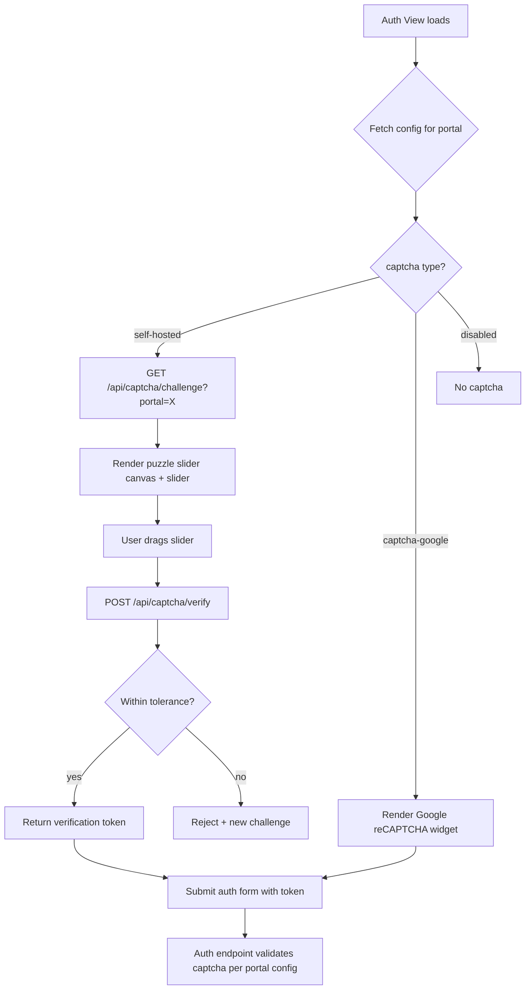

# Design Document: Captcha System

## Overview

Replace the single-provider Google reCAPTCHA with a configurable multi-captcha system. Each portal (admin, seller, client) independently selects between self-hosted puzzle slider, Google reCAPTCHA v2, or disabled. A global kill-switch disables all captcha. The self-hosted captcha uses `sharp` to generate puzzle images server-side, validated via an in-memory challenge store with TTL.

## Architecture



## Components and Interfaces

### Backend Components

- `Backend/services/captcha.service.js` — Core captcha logic
  - `generateChallenge(portal)` — Uses `sharp` to pick a random background from `Backend/public/captcha-backgrounds/`, cuts a puzzle piece at random (x, y), returns `{ backgroundBase64, pieceBase64, token, pieceY }`
  - `verifyChallenge(token, submittedX)` — Compares submitted X against stored X within tolerance margin, invalidates token after use
  - In-memory `Map<token, { expectedX, createdAt }>` with periodic TTL cleanup (60s interval, 120s expiry)

- `Backend/controllers/captcha.controller.js` — HTTP handlers
  - `GET /api/captcha/challenge?portal=<portal>` — Returns challenge images + token + pieceY
  - `POST /api/captcha/verify` — Body: `{ token, x }`, returns `{ success, verificationToken }`

- `Backend/controllers/config.controller.js` — Modify `getRecaptchaLoginConfig` to accept `?portal=` query param and return portal-specific config

- `Backend/controllers/auth.controller.js` — Modify `login`, `recoverPassword`, `resetPassword` to:
  - Read portal from request body
  - Determine captcha type from config
  - Route validation to Google or self-hosted or skip

- `Backend/services/captcha.service.js` registered in `Backend/config/container.js` via Awilix

### Frontend Components

- `Frontend/public/js/puzzle-captcha.js` — Reusable puzzle slider module
  - `initPuzzleCaptcha(containerEl, { apiUrl, portal, onVerified })` — Fetches challenge, renders two canvases (background + piece), creates slider input
  - Handles drag interaction, submits verification, calls `onVerified(verificationToken)` on success
  - Supports dark/light theme via CSS custom properties from parent auth forms

- `Frontend/src/modules/FormSignIn.astro` — Modify to:
  - Fetch portal-specific config with `?portal=` param
  - Conditionally render Google reCAPTCHA or puzzle captcha container
  - Pass verification token in form submission

- `Frontend/src/modules/FormForgotPassword.astro` — Same modifications as FormSignIn

- `Frontend/src/modules/FormResetPassword.astro` — Same modifications as FormSignIn

- `Frontend/public/js/sign-in.js` — Update `initSignIn` config to accept `captchaType` and handle both captcha flows

### New Routes Registration

In `Backend/app.js`:
- `GET /api/captcha/challenge` — public, rate-limited
- `POST /api/captcha/verify` — public, rate-limited

### Static Assets

- `Backend/public/captcha-backgrounds/` — Directory with 5-10 background images (landscape photos, ~800x400px)

## Data Models

### Captcha Config JSON Structure (stored in `param_config.params` for `setRecapchaLogin`)

```json
{
  "enable": 1,
  "portal": {
    "admin": { "active": 1, "type": "self-hosted" },
    "seller": { "active": 1, "type": "captcha-google" },
    "client": { "active": 0, "type": "self-hosted" }
  }
}
```

### In-Memory Challenge Store Entry

- Key: `token` (UUID string)
- Value: `{ expectedX: number, createdAt: number }`
- TTL: 120 seconds
- Cleanup interval: 60 seconds

### Challenge API Response

```
GET /api/captcha/challenge?portal=admin
→ { background: <base64>, piece: <base64>, token: <uuid>, pieceY: <number> }
```

### Verify API Request/Response

```
POST /api/captcha/verify
← { token: <uuid>, x: <number> }
→ { success: true, verificationToken: <uuid> }
```

### Portal Config API Response (updated)

```
GET /api/config/recaptcha-login?portal=admin
→ { active: 1, type: "self-hosted" }

GET /api/config/recaptcha-login (no portal param)
→ { enable: 1, portal: { admin: {...}, seller: {...}, client: {...} } }

GET /api/config/recaptcha-login?portal=admin (when enable=0)
→ { active: 0 }
```


## Correctness Properties

*A property is a characteristic or behavior that should hold true across all valid executions of a system — essentially, a formal statement about what the system should do. Properties serve as the bridge between human-readable specifications and machine-verifiable correctness guarantees.*

### Property 1: Global kill-switch disables all portals

*For any* captcha configuration where `enable` is `0`, and *for any* portal name (including valid, invalid, or missing), resolving the captcha config for that portal SHALL return captcha as disabled.

**Validates: Requirements 1.1, 8.3**

### Property 2: Per-portal config resolution

*For any* captcha configuration where `enable` is `1`, and *for any* portal name, the resolved captcha state SHALL match that portal's `active` and `type` fields. If the portal entry is missing, the result SHALL be disabled.

**Validates: Requirements 1.2, 2.1, 2.2, 2.4, 8.1, 8.4**

### Property 3: Config serialization round-trip

*For any* valid captcha configuration object (with `enable`, `portal` map containing `active` and `type` per portal), serializing to JSON and deserializing SHALL produce an equivalent object.

**Validates: Requirements 1.3**

### Property 4: Valid captcha type enforcement

*For any* portal configuration, the `type` field SHALL only accept `"self-hosted"` or `"captcha-google"`. Any other value SHALL be treated as invalid/disabled.

**Validates: Requirements 2.3**

### Property 5: Challenge response completeness

*For any* self-hosted captcha challenge request, the response SHALL contain a non-empty background image, a non-empty puzzle piece image, a challenge token, and a pieceY coordinate.

**Validates: Requirements 3.1, 3.4**

### Property 6: Challenge position randomness

*For any* sequence of N (N ≥ 10) captcha challenge generations, the set of generated X-positions SHALL NOT all be identical.

**Validates: Requirements 3.3**

### Property 7: Verification accepts within tolerance

*For any* generated challenge with expected position X, and *for any* submitted position X' where `|X - X'| ≤ tolerance`, the verification SHALL succeed.

**Validates: Requirements 5.1, 5.2**

### Property 8: Verification rejects outside tolerance

*For any* generated challenge with expected position X, and *for any* submitted position X' where `|X - X'| > tolerance`, the verification SHALL fail.

**Validates: Requirements 5.3**

### Property 9: Challenge token single-use

*For any* generated challenge token, after one verification attempt (regardless of success or failure), a second verification attempt with the same token SHALL fail.

**Validates: Requirements 5.4**

### Property 10: Auth skips validation when captcha disabled

*For any* auth request (login, recoverPassword, resetPassword) where captcha is disabled (globally or per-portal), the request SHALL NOT require captcha data to proceed.

**Validates: Requirements 7.4**

### Property 11: Auth rejects on failed captcha validation

*For any* auth request where captcha is enabled and the provided captcha data is invalid, the request SHALL be rejected with an error message.

**Validates: Requirements 7.5**

## Error Handling

- **Missing background images**: If `captcha-backgrounds/` is empty, `generateChallenge` returns a 503 error
- **Expired/invalid token**: `verifyChallenge` returns `{ success: false }` — frontend requests a new challenge
- **Config parse failure**: `getRecaptchaLoginConfig` falls back to `{ enable: 0 }` (captcha disabled)
- **Missing portal in config**: Treated as `{ active: 0 }` — captcha disabled for that portal
- **Sharp processing failure**: Caught and logged, returns 500 — frontend shows retry option
- **Rate limiting**: Challenge and verify endpoints use existing `readLimiter`/`writeLimiter`
- **Google reCAPTCHA failure**: Existing error handling preserved — returns 400 with `captcha_failed` message

## Testing Strategy

### Unit Tests

- Config resolution logic: specific examples for enable=0, enable=1 with various portal combos, missing portals
- Challenge generation: verify image dimensions, base64 format, token format
- Verify endpoint: specific examples for exact match, within tolerance, outside tolerance, expired token, reused token
- Config endpoint: specific examples for with/without portal param, missing portal, enable=0

### Property-Based Tests

Use `fast-check` library for property-based testing in Node.js.

Each property test MUST:
- Run minimum 100 iterations
- Reference its design property with a comment tag: `// Feature: captcha-system, Property N: <title>`
- Be implemented as a single property-based test per design property

Properties to implement:
- Property 1: Generate random configs with enable=0, random portal names → all resolve to disabled
- Property 2: Generate random configs with enable=1, random portal entries → resolved state matches config
- Property 3: Generate random config objects → JSON.stringify then JSON.parse produces equivalent object
- Property 4: Generate random type strings → only "self-hosted" and "captcha-google" are accepted
- Property 5: Call generateChallenge repeatedly → all responses have required fields
- Property 6: Generate 10+ challenges → not all X positions identical
- Property 7: Generate challenges, submit X within tolerance → all succeed
- Property 8: Generate challenges, submit X outside tolerance → all fail
- Property 9: Generate challenge, verify once, verify again → second fails
- Property 10: Set config to disabled, send auth request without captcha → succeeds
- Property 11: Set config to enabled, send auth request with bad captcha → fails
