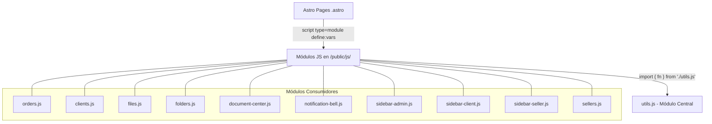
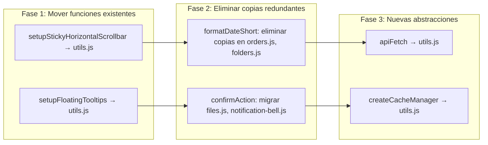

# Documento de Diseño: Frontend Code Refactoring

## Resumen

Este diseño describe la estrategia técnica para eliminar duplicaciones de funciones en el frontend de la plataforma Gelymar. El proyecto usa Astro con ES modules (`import`/`export`) y los archivos JS residen en `Frontend/public/js/`. El archivo `utils.js` ya actúa como módulo central de utilidades compartidas. La refactorización consolida código duplicado en `utils.js` y crea dos nuevas abstracciones (`apiFetch` y `createCacheManager`) sin alterar funcionalidad existente.

### Hallazgos del Análisis

| Función | Copias encontradas | Archivos afectados |
|---|---|---|
| `setupFloatingTooltips` | 7 copias | orders.js, document-center.js, folders.js, files.js, clients.js, sidebar-admin.js, sidebar-client.js, sidebar-seller.js |
| `setupStickyHorizontalScrollbar` | 2 copias | orders.js, document-center.js |
| `formatDateShort` | 3 copias locales + 1 en utils | orders.js, document-center.js, folders.js |
| `confirmAction` | 2 copias locales + 1 en utils | files.js, notification-bell.js |
| Patrón fetch con `Authorization: Bearer` | ~40+ ocurrencias | 12+ archivos |
| Patrón caché localStorage | 2 implementaciones | orders.js, clients.js |

### Diferencias detectadas en copias locales

- **`confirmAction` en `files.js`**: Soporta tipos adicionales (`question`, `error` con botón "Entendido"), no tiene `options` param ni `onConfirm` callback. La versión de utils.js es más completa (soporta `options` con `onConfirm`, `loadingText`, etc.).
- **`confirmAction` en `notification-bell.js`**: Versión simplificada, solo soporta `warning` e `info`, usa textos de traducción locales (`notificationsTexts`). No acepta `options` param.
- **`formatDateShort` en `document-center.js`**: Implementación diferente que calcula fechas relativas ("hoy", "ayer") en vez del formato `YYYY-MM-DD` de utils.js. Requiere análisis de uso antes de migrar.
- **`formatDateShort` en `orders.js` y `folders.js`**: Misma lógica que utils.js (formato `YYYY-MM-DD`), migración directa.

## Arquitectura

### Patrón de módulos actual



### Estrategia de migración



## Componentes e Interfaces

### 1. setupStickyHorizontalScrollbar (mover a utils.js)

```javascript
/**
 * Configura una barra de scroll horizontal sticky sincronizada con el contenido.
 * Busca contenedores con [data-scroll-sync] y sincroniza scroll entre body, track y header.
 * @returns {void}
 */
export function setupStickyHorizontalScrollbar() { ... }
```

La implementación se toma directamente de `orders.js` (idéntica a `document-center.js`). Se exporta desde `utils.js` y los consumidores la importan.

### 2. setupFloatingTooltips (mover a utils.js)

```javascript
/**
 * Inicializa tooltips flotantes en elementos con atributo [data-tooltip].
 * @param {HTMLElement} container - Contenedor donde buscar elementos con tooltips
 * @returns {void}
 */
export function setupFloatingTooltips(container) { ... }
```

Requiere también mover los handlers `handleTooltipEnter` y `handleTooltipLeave` a utils.js, ya que son dependencias internas de `setupFloatingTooltips`.

### 3. formatDateShort (eliminar copias)

La función ya existe en `utils.js`. Las copias en `orders.js` y `folders.js` son equivalentes y se eliminan directamente.

**Caso especial**: `document-center.js` tiene una implementación diferente que muestra fechas relativas. Se debe verificar si los usos en `document-center.js` requieren el formato relativo o el estándar `YYYY-MM-DD`.

### 4. confirmAction (eliminar copias)

La versión de `utils.js` es la más completa. Las copias locales en `files.js` y `notification-bell.js` son subconjuntos funcionales.

**Adaptaciones necesarias**:
- `files.js`: La copia local soporta tipo `question` y muestra "Entendido" para tipo `error`. Se debe extender la versión de utils.js para soportar estos tipos, o adaptar las llamadas.
- `notification-bell.js`: La copia local usa textos de traducción locales (`notificationsTexts`). Se debe pasar los textos via el parámetro `options` de la versión de utils.js.

### 5. apiFetch (nueva función)

```javascript
/**
 * Realiza peticiones HTTP autenticadas con el token JWT.
 * @param {string} url - URL de la petición
 * @param {RequestInit} [options={}] - Opciones de fetch (method, headers, body, etc.)
 * @returns {Promise<Response>} - Objeto Response de fetch
 */
export async function apiFetch(url, options = {}) {
  const token = localStorage.getItem('token');
  if (!token) {
    window.location.href = '/authentication/sign-in';
    return;
  }

  const headers = {
    Authorization: `Bearer ${token}`,
    ...options.headers,
  };

  const response = await fetch(url, { ...options, headers });

  if (response.status === 401) {
    localStorage.removeItem('token');
    window.location.href = '/authentication/sign-in';
    return;
  }

  return response;
}
```

### 6. createCacheManager (nueva función)

```javascript
/**
 * Crea un gestor de caché basado en localStorage con expiración configurable.
 * @param {string} cacheKey - Prefijo para las claves en localStorage
 * @param {number} duration - Duración del caché en milisegundos
 * @returns {{ isValid: () => boolean, save: (data: any) => void, load: () => any|null, clear: () => void }}
 */
export function createCacheManager(cacheKey, duration) {
  const dataKey = cacheKey;
  const timestampKey = `${cacheKey}_timestamp`;

  return {
    isValid() {
      const timestamp = localStorage.getItem(timestampKey);
      if (!timestamp) return false;
      return (Date.now() - parseInt(timestamp)) < duration;
    },
    save(data) {
      try {
        localStorage.setItem(dataKey, JSON.stringify(data));
        localStorage.setItem(timestampKey, Date.now().toString());
      } catch (error) {
        console.warn(`Cache save error [${cacheKey}]:`, error);
      }
    },
    load() {
      try {
        const cached = localStorage.getItem(dataKey);
        return cached ? JSON.parse(cached) : null;
      } catch (error) {
        console.warn(`Cache load error [${cacheKey}]:`, error);
        return null;
      }
    },
    clear() {
      localStorage.removeItem(dataKey);
      localStorage.removeItem(timestampKey);
    }
  };
}
```

## Modelos de Datos

No se introducen nuevos modelos de datos. Las funciones operan sobre los mismos tipos existentes:

- **apiFetch**: Recibe `string` (URL) y `RequestInit` (opciones de fetch). Retorna `Promise<Response>`.
- **createCacheManager**: Recibe `string` (cacheKey) y `number` (duration ms). Retorna un objeto con 4 métodos. Los datos almacenados son serializados/deserializados con `JSON.stringify`/`JSON.parse`.
- **setupStickyHorizontalScrollbar**: Sin parámetros. Opera sobre elementos DOM con atributos `data-scroll-sync`, `data-scroll-body`, `data-scrollbar`, etc.
- **setupFloatingTooltips**: Recibe `HTMLElement` (container). Opera sobre elementos con atributo `data-tooltip`.


## Propiedades de Correctitud

*Una propiedad es una característica o comportamiento que debe mantenerse verdadero en todas las ejecuciones válidas de un sistema — esencialmente, una declaración formal sobre lo que el sistema debe hacer. Las propiedades sirven como puente entre especificaciones legibles por humanos y garantías de correctitud verificables por máquina.*

### Propiedad 1: formatDateShort produce formato YYYY-MM-DD

*Para cualquier* fecha válida (objeto Date o string ISO), `formatDateShort` debe retornar un string que coincida con el patrón `YYYY-MM-DD` o `-` si la entrada es nula/inválida.

**Valida: Requerimiento 3.1**

### Propiedad 2: Equivalencia de formatDateShort entre utils y copias locales

*Para cualquier* string de fecha válido, la función `formatDateShort` de `utils.js` debe producir exactamente el mismo resultado que las implementaciones locales de `orders.js` y `folders.js`.

**Valida: Requerimiento 3.3**

### Propiedad 3: apiFetch preserva headers de autorización y headers personalizados

*Para cualquier* URL, token válido en localStorage, y conjunto de headers personalizados en options, `apiFetch` debe producir una petición que contenga tanto el header `Authorization: Bearer {token}` como todos los headers personalizados sin sobrescribir ninguno.

**Valida: Requerimientos 5.2, 5.5**

### Propiedad 4: apiFetch retorna Response

*Para cualquier* petición exitosa (status != 401) con token válido, `apiFetch` debe retornar un objeto `Response` de fetch.

**Valida: Requerimiento 5.6**

### Propiedad 5: CacheManager round-trip (save/load)

*Para cualquier* dato serializable a JSON, cacheKey y duración, si se llama `save(data)` y luego `load()` inmediatamente (dentro del período de validez), el resultado debe ser profundamente igual al dato original, y `isValid()` debe retornar `true`.

**Valida: Requerimientos 6.2, 6.3**

## Manejo de Errores

| Escenario | Comportamiento esperado |
|---|---|
| `apiFetch` sin token en localStorage | Redirige a `/authentication/sign-in`, no lanza excepción |
| `apiFetch` recibe respuesta 401 | Limpia token de localStorage, redirige a `/authentication/sign-in` |
| `CacheManager.save()` con localStorage lleno | Captura excepción, registra `console.warn`, no interrumpe ejecución |
| `CacheManager.load()` con datos corruptos en localStorage | Captura excepción de `JSON.parse`, retorna `null`, registra `console.warn` |
| `setupFloatingTooltips` con container `null` | Retorna inmediatamente sin error |
| `setupStickyHorizontalScrollbar` sin elementos `[data-scroll-sync]` | Retorna inmediatamente sin error |
| `formatDateShort` con entrada `null`, `undefined` o fecha inválida | Retorna `'-'` |

## Estrategia de Testing

### Enfoque dual

Se utilizan dos tipos de tests complementarios:

- **Tests unitarios**: Verifican ejemplos específicos, edge cases y condiciones de error
- **Tests de propiedades (PBT)**: Verifican propiedades universales con inputs generados aleatoriamente

### Librería de Property-Based Testing

Se usará **fast-check** (`fc`) para JavaScript, que es compatible con cualquier test runner (Jest, Vitest, Mocha).

### Configuración de tests de propiedades

- Mínimo 100 iteraciones por test de propiedad
- Cada test debe referenciar la propiedad del diseño con un comentario
- Formato del tag: **Feature: frontend-code-refactoring, Property {número}: {texto}**

### Tests unitarios (ejemplos y edge cases)

| Test | Tipo | Valida |
|---|---|---|
| `setupStickyHorizontalScrollbar` se exporta desde utils.js | ejemplo | Req 1.1 |
| `setupFloatingTooltips` se exporta desde utils.js | ejemplo | Req 2.1 |
| `confirmAction` se exporta desde utils.js | ejemplo | Req 4.1 |
| `apiFetch` se exporta desde utils.js | ejemplo | Req 5.1 |
| `createCacheManager` retorna objeto con métodos isValid, save, load, clear | ejemplo | Req 6.1 |
| `apiFetch` redirige cuando no hay token | edge-case | Req 5.3 |
| `apiFetch` redirige cuando respuesta es 401 | edge-case | Req 5.4 |
| `CacheManager.save()` no lanza cuando localStorage está lleno | edge-case | Req 6.6 |

### Tests de propiedades

| Test | Propiedad | Iteraciones |
|---|---|---|
| formatDateShort produce YYYY-MM-DD para fechas válidas | Propiedad 1 | 100 |
| formatDateShort equivalencia utils vs copias locales | Propiedad 2 | 100 |
| apiFetch preserva Authorization + headers personalizados | Propiedad 3 | 100 |
| apiFetch retorna Response para peticiones exitosas | Propiedad 4 | 100 |
| CacheManager round-trip save/load | Propiedad 5 | 100 |
