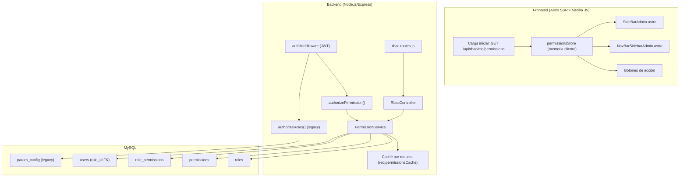
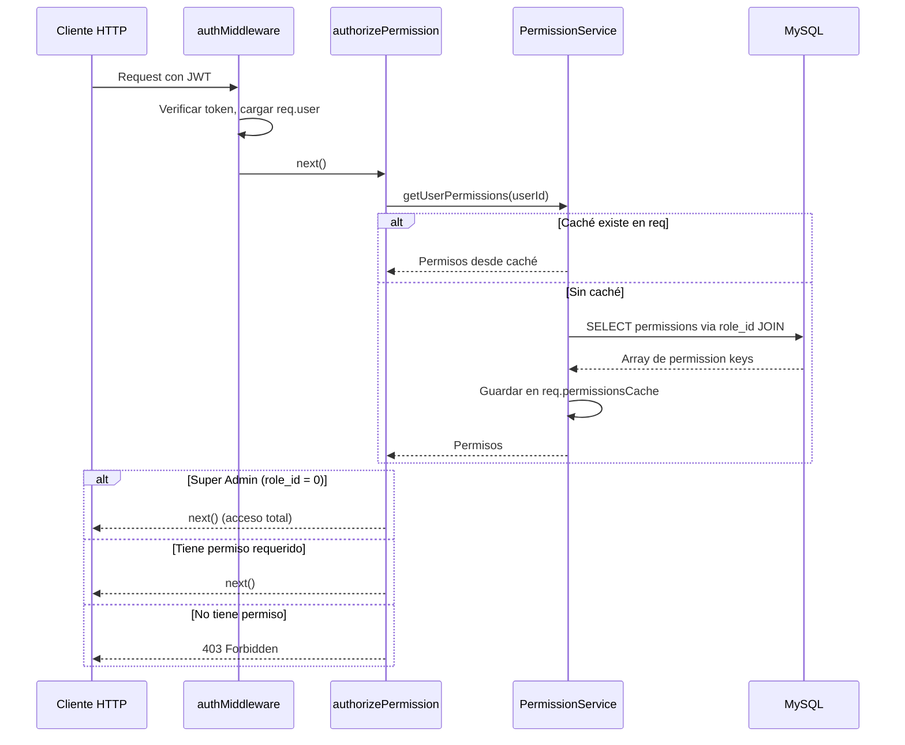
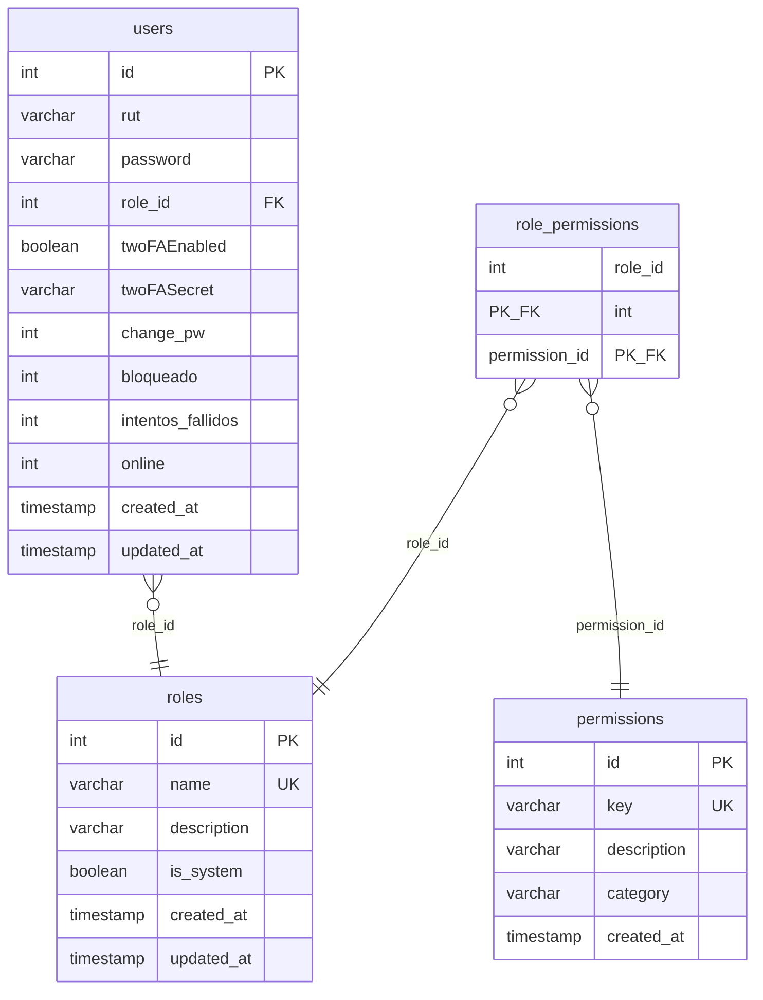

# Documento de Diseño — Sistema Granular de Permisos RBAC

## Resumen

Este documento describe el diseño técnico para implementar un sistema de control de acceso basado en roles (RBAC) granular que reemplace el mecanismo actual de `authorizeRoles()` y la tabla `param_config` para visibilidad de UI. El sistema introduce tablas MySQL dedicadas (`roles`, `permissions`, `role_permissions`), un servicio centralizado de permisos con caché por request, un middleware `authorizePermission()` compatible con el existente, y una API REST para gestión de roles/permisos accesible solo por Super Admin. El frontend consultará un endpoint `/api/rbac/me/permissions` al cargar la app y usará los permisos en memoria para controlar la visibilidad de elementos UI (sidebar, header, botones de acción).

## Arquitectura

### Diagrama de Componentes



### Flujo de Autorización



### Decisiones de Diseño

1. **Caché por request (no global)**: Los permisos se cachean en `req._permissionsCache` durante la vida de una petición HTTP. Esto evita consultas repetidas dentro de la misma request sin necesidad de invalidación compleja de caché global. Para el endpoint `/api/rbac/me/permissions` que el frontend llama una sola vez al cargar, la latencia de una query SQL es aceptable (<50ms).

2. **Super Admin como role_id=0**: Se usa `id=0` para Super Admin para no colisionar con los IDs existentes (1=admin, 2=client, 3=seller). El Super Admin bypasea toda verificación de permisos.

3. **Compatibilidad dual**: `authorizeRoles()` sigue funcionando sin cambios. `authorizePermission()` es un middleware nuevo que se usa en paralelo. La migración es gradual, ruta por ruta.

4. **Fallback a authorizeRoles()**: Si la consulta RBAC falla (error de BD), el middleware `authorizePermission()` delega al comportamiento de `authorizeRoles()` y loguea el error, garantizando que el sistema no se caiga.

5. **Permisos como strings planos**: Las claves de permiso siguen el formato `categoria.accion` (ej: `orders.create`, `sidebar.clients`). Esto es simple de consultar, comparar y almacenar.

## Componentes e Interfaces

### 1. PermissionService (`Backend/services/permission.service.js`)

Servicio centralizado registrado en el contenedor Awilix.

```javascript
// Interfaz pública
class PermissionService {
  /**
   * Obtiene todos los permisos efectivos de un usuario por su ID.
   * @param {number} userId - ID del usuario
   * @param {object} [reqCache] - Objeto de caché por request (req._permissionsCache)
   * @returns {Promise<string[]>} Array de claves de permiso
   */
  async getUserPermissions(userId, reqCache) {}

  /**
   * Verifica si un usuario tiene un permiso específico.
   * @param {number} userId - ID del usuario
   * @param {string} permissionKey - Clave del permiso (ej: 'orders.create')
   * @param {object} [reqCache] - Objeto de caché por request
   * @returns {Promise<boolean>}
   */
  async hasPermission(userId, permissionKey, reqCache) {}

  /**
   * Obtiene el role_id de un usuario.
   * @param {number} userId
   * @returns {Promise<number|null>}
   */
  async getUserRoleId(userId) {}

  /**
   * Obtiene todos los roles con sus permisos asociados.
   * @returns {Promise<Array<{id, name, description, is_system, permissions: string[]}>>}
   */
  async getAllRolesWithPermissions() {}

  /**
   * Obtiene todos los permisos agrupados por categoría.
   * @returns {Promise<Object<string, Array<{id, key, description}>>>}
   */
  async getAllPermissionsByCategory() {}

  /**
   * Crea un nuevo rol con permisos.
   * @param {{name: string, description: string, permissionIds: number[]}} data
   * @returns {Promise<{id: number}>}
   */
  async createRole(data) {}

  /**
   * Actualiza un rol existente y sus permisos.
   * @param {number} roleId
   * @param {{name: string, description: string, permissionIds: number[]}} data
   * @returns {Promise<boolean>}
   */
  async updateRole(roleId, data) {}

  /**
   * Elimina un rol no-sistema.
   * @param {number} roleId
   * @returns {Promise<boolean>}
   */
  async deleteRole(roleId) {}

  /**
   * Asigna un rol a un usuario.
   * @param {number} userId
   * @param {number} roleId
   * @returns {Promise<boolean>}
   */
  async assignRoleToUser(userId, roleId) {}
}
```

### 2. Middleware authorizePermission (`Backend/middleware/permission.middleware.js`)

```javascript
/**
 * Middleware factory que verifica permisos granulares.
 * @param {...string} requiredPermissions - Uno o más permisos requeridos (OR lógico)
 * @returns {Function} Express middleware
 *
 * Uso: router.get('/orders', authMiddleware, authorizePermission('orders.view'), controller.getAll)
 */
function authorizePermission(...requiredPermissions) {}
```

### 3. RbacController (`Backend/controllers/rbac.controller.js`)

```javascript
// Endpoints
exports.getRoles = async (req, res) => {}           // GET /api/rbac/roles
exports.createRole = async (req, res) => {}          // POST /api/rbac/roles
exports.updateRole = async (req, res) => {}          // PUT /api/rbac/roles/:id
exports.deleteRole = async (req, res) => {}          // DELETE /api/rbac/roles/:id
exports.getPermissions = async (req, res) => {}      // GET /api/rbac/permissions
exports.assignUserRole = async (req, res) => {}      // PUT /api/rbac/users/:id/role
exports.getMyPermissions = async (req, res) => {}    // GET /api/rbac/me/permissions
```

### 4. Rutas RBAC (`Backend/routes/rbac.routes.js`)

```javascript
// Todas las rutas requieren authMiddleware
// Rutas de gestión requieren authorizePermission('rbac.manage') o Super Admin
router.get('/me/permissions', authMiddleware, rbacController.getMyPermissions);
router.get('/roles', authMiddleware, authorizePermission('rbac.manage'), rbacController.getRoles);
router.post('/roles', authMiddleware, authorizePermission('rbac.manage'), rbacController.createRole);
router.put('/roles/:id', authMiddleware, authorizePermission('rbac.manage'), rbacController.updateRole);
router.delete('/roles/:id', authMiddleware, authorizePermission('rbac.manage'), rbacController.deleteRole);
router.get('/permissions', authMiddleware, authorizePermission('rbac.manage'), rbacController.getPermissions);
router.put('/users/:id/role', authMiddleware, authorizePermission('rbac.manage'), rbacController.assignUserRole);
```

### 5. Frontend Permission Store (`Frontend/public/js/permissions.js`)

```javascript
// Módulo vanilla JS que gestiona permisos en el cliente
const PermissionStore = {
  _permissions: [],
  _role: null,

  /** Carga permisos desde el backend. Se llama una vez al iniciar la app. */
  async init(apiBase, token) {},

  /** Verifica si el usuario tiene un permiso. */
  has(permissionKey) {},

  /** Oculta/muestra elementos del DOM según data-permission="key". */
  applyToDOM() {},
};
```

### 6. Registro en Contenedor Awilix (`Backend/config/container.js`)

Se registrará `permissionService` como singleton en el contenedor existente:

```javascript
const { createPermissionService } = require('../services/permission.service');
// ...
container.register({
  permissionService: asFunction((deps) => createPermissionService(deps)).singleton(),
});
```

## Modelo de Datos

### Diagrama Entidad-Relación



### Tabla `roles`

| Columna | Tipo | Restricciones | Descripción |
|---------|------|---------------|-------------|
| id | INT | PK, AUTO_INCREMENT | Identificador único |
| name | VARCHAR(100) | UNIQUE, NOT NULL | Nombre del rol |
| description | VARCHAR(255) | NULL | Descripción del rol |
| is_system | BOOLEAN | DEFAULT FALSE | Si es rol de sistema (no eliminable) |
| created_at | TIMESTAMP | DEFAULT CURRENT_TIMESTAMP | Fecha de creación |
| updated_at | TIMESTAMP | DEFAULT CURRENT_TIMESTAMP ON UPDATE | Fecha de actualización |

Roles iniciales (seed):

| id | name | description | is_system |
|----|------|-------------|-----------|
| 0 | Super Admin | Acceso total al sistema | true |
| 1 | Admin | Administrador | true |
| 2 | Cliente | Cliente | true |
| 3 | Vendedor | Vendedor | true |

### Tabla `permissions`

| Columna | Tipo | Restricciones | Descripción |
|---------|------|---------------|-------------|
| id | INT | PK, AUTO_INCREMENT | Identificador único |
| key | VARCHAR(100) | UNIQUE, NOT NULL | Clave del permiso (ej: `orders.create`) |
| description | VARCHAR(255) | NULL | Descripción legible |
| category | VARCHAR(50) | NOT NULL | Categoría para agrupación |
| created_at | TIMESTAMP | DEFAULT CURRENT_TIMESTAMP | Fecha de creación |

Categorías y permisos iniciales (seed):

**sidebar**: `sidebar.dashboard`, `sidebar.clients`, `sidebar.sellers`, `sidebar.orders`, `sidebar.messaging`

**header**: `header.client_search`, `header.notifications`, `header.users_without_account`, `header.orders_without_documents`

**orders**: `orders.view`, `orders.create`, `orders.edit`, `orders.delete`, `orders.send_email`, `orders.client_visibility`, `orders.view_details`, `orders.search`, `orders.view_items`, `orders.view_price_analysis`, `orders.view_sales_dashboard`, `orders.view_alerts`

**documents**: `documents.view`, `documents.upload`, `documents.generate`, `documents.regenerate`, `documents.send`, `documents.bulk_send`, `documents.resend`, `documents.rename`, `documents.delete`, `documents.create_default`

**users**: `users.view`, `users.create`, `users.edit`, `users.delete`, `users.reset_password`, `users.block`, `users.view_admins`, `users.manage_admins`

**sellers**: `sellers.view`, `sellers.edit`, `sellers.change_password`

**customers**: `customers.view`, `customers.edit`

**settings**: `settings.view`, `settings.edit`, `settings.pdf_mail_list`, `settings.notification_email_list`, `settings.profile`, `settings.change_password`, `settings.param_config`, `settings.admin_users`

**rbac**: `rbac.manage`

### Tabla `role_permissions`

| Columna | Tipo | Restricciones | Descripción |
|---------|------|---------------|-------------|
| role_id | INT | PK, FK → roles.id, ON DELETE CASCADE | ID del rol |
| permission_id | INT | PK, FK → permissions.id, ON DELETE CASCADE | ID del permiso |

### Mapeo de Permisos por Defecto (Seed)

El seed asignará permisos equivalentes al acceso actual:

- **Admin (id=1)**: Todos los permisos excepto `rbac.manage`
- **Cliente (id=2)**: `sidebar.orders`, `orders.view`, `orders.view_details`, `orders.search`, `orders.view_items`, `documents.view`
- **Vendedor (id=3)**: `sidebar.clients`, `sidebar.orders`, `orders.view`, `orders.view_details`, `orders.search`, `orders.view_items`, `documents.view`, `documents.rename`, `customers.view`, `sellers.view`

### SQL de Migración

```sql
-- Nota: La tabla `roles` ya existe en el sistema actual.
-- La migración solo agrega columnas faltantes si es necesario.

-- Agregar columnas a roles si no existen
ALTER TABLE roles
  ADD COLUMN IF NOT EXISTS description VARCHAR(255) DEFAULT NULL,
  ADD COLUMN IF NOT EXISTS is_system BOOLEAN DEFAULT FALSE,
  ADD COLUMN IF NOT EXISTS created_at TIMESTAMP DEFAULT CURRENT_TIMESTAMP,
  ADD COLUMN IF NOT EXISTS updated_at TIMESTAMP DEFAULT CURRENT_TIMESTAMP ON UPDATE CURRENT_TIMESTAMP;

-- Insertar Super Admin (id=0) si no existe
INSERT IGNORE INTO roles (id, name, description, is_system) VALUES
  (0, 'Super Admin', 'Acceso total al sistema', TRUE);

-- Marcar roles existentes como sistema
UPDATE roles SET is_system = TRUE, description = 'Administrador' WHERE id = 1;
UPDATE roles SET is_system = TRUE, description = 'Cliente' WHERE id = 2;
UPDATE roles SET is_system = TRUE, description = 'Vendedor' WHERE id = 3;

-- Crear tabla permissions
CREATE TABLE IF NOT EXISTS permissions (
  id INT AUTO_INCREMENT PRIMARY KEY,
  `key` VARCHAR(100) NOT NULL UNIQUE,
  description VARCHAR(255) DEFAULT NULL,
  category VARCHAR(50) NOT NULL,
  created_at TIMESTAMP DEFAULT CURRENT_TIMESTAMP,
  INDEX idx_permissions_category (category),
  INDEX idx_permissions_key (`key`)
) ENGINE=InnoDB DEFAULT CHARSET=utf8mb4;

-- Crear tabla role_permissions
CREATE TABLE IF NOT EXISTS role_permissions (
  role_id INT NOT NULL,
  permission_id INT NOT NULL,
  PRIMARY KEY (role_id, permission_id),
  FOREIGN KEY (role_id) REFERENCES roles(id) ON DELETE CASCADE,
  FOREIGN KEY (permission_id) REFERENCES permissions(id) ON DELETE CASCADE
) ENGINE=InnoDB DEFAULT CHARSET=utf8mb4;
```


## Propiedades de Correctitud

*Una propiedad es una característica o comportamiento que debe mantenerse verdadero en todas las ejecuciones válidas de un sistema — esencialmente, una declaración formal sobre lo que el sistema debe hacer. Las propiedades sirven como puente entre especificaciones legibles por humanos y garantías de correctitud verificables por máquinas.*

### Propiedad 1: Resolución de permisos por rol

*Para cualquier* rol con un conjunto arbitrario de permisos asignados en `role_permissions`, y *para cualquier* usuario con ese `role_id`, `getUserPermissions(userId)` debe retornar exactamente el conjunto de claves de permiso asignadas a ese rol — ni más, ni menos.

**Valida: Requisitos 2.1, 2.2, 2.5**

### Propiedad 2: Consistencia entre hasPermission y getUserPermissions

*Para cualquier* usuario y *para cualquier* clave de permiso, `hasPermission(userId, permissionKey)` debe retornar `true` si y solo si `permissionKey` está contenido en el arreglo retornado por `getUserPermissions(userId)`.

**Valida: Requisitos 2.4**

### Propiedad 3: Super Admin tiene acceso total

*Para cualquier* clave de permiso (incluyendo strings arbitrarios que no existan en la tabla `permissions`), si el usuario tiene `role_id = 0` (Super Admin), entonces `hasPermission(userId, permissionKey)` debe retornar `true`.

**Valida: Requisitos 2.6**

### Propiedad 4: Correctitud de autorización del middleware

*Para cualquier* conjunto de permisos requeridos R y *para cualquier* conjunto de permisos del usuario U, el middleware `authorizePermission(...R)` debe llamar a `next()` si la intersección de R y U es no vacía, y debe responder con HTTP 403 si la intersección es vacía.

**Valida: Requisitos 3.2, 3.3, 7.2, 8.2, 9.4**

## Manejo de Errores

### Errores del Middleware de Permisos

| Escenario | Código HTTP | Respuesta | Acción |
|-----------|-------------|-----------|--------|
| Usuario sin token/token inválido | 401 | `{ "message": "Token requerido" }` | Manejado por `authMiddleware` existente |
| Usuario sin `req.user` válido | 401 | `{ "message": "Usuario no autenticado" }` | Retorno inmediato |
| Usuario sin permiso requerido | 403 | `{ "message": "No tiene permisos para acceder a este recurso" }` | Log warning + retorno |
| Error de BD al consultar permisos | Fallback | Delega a `authorizeRoles()` | Log error + fallback |

### Errores de la API RBAC

| Escenario | Código HTTP | Respuesta |
|-----------|-------------|-----------|
| Crear rol con nombre duplicado | 409 | `{ "message": "Ya existe un rol con ese nombre" }` |
| Eliminar rol de sistema | 400 | `{ "message": "No se puede eliminar un rol de sistema" }` |
| Eliminar rol con usuarios asignados | 400 | `{ "message": "No se puede eliminar un rol con usuarios asignados" }` |
| Rol no encontrado | 404 | `{ "message": "Rol no encontrado" }` |
| Usuario no encontrado (asignar rol) | 404 | `{ "message": "Usuario no encontrado" }` |
| Datos de entrada inválidos | 400 | `{ "message": "Datos inválidos", "errors": [...] }` |
| Error interno de BD | 500 | `{ "message": "Error interno del servidor" }` |

### Estrategia de Fallback

Cuando `authorizePermission()` no puede resolver permisos (error de BD), el middleware:

1. Captura el error
2. Registra el error con `logger.error()`
3. Verifica si `req.user.role` está disponible (del JWT)
4. Si está disponible, aplica la lógica equivalente a `authorizeRoles()` usando el rol del token
5. Si no está disponible, retorna 500

Esto garantiza que un fallo en las tablas RBAC no deja el sistema inaccesible.

## Estrategia de Testing

### Tests Unitarios

- **PermissionService**: Verificar `getUserPermissions`, `hasPermission`, operaciones CRUD de roles
- **authorizePermission middleware**: Verificar respuestas 401, 403, next() con mocks
- **Fallback a authorizeRoles**: Verificar que errores de BD activan el fallback
- **RbacController**: Verificar validación de entrada, respuestas HTTP correctas
- **Frontend PermissionStore**: Verificar `has()`, `applyToDOM()` con datos mock

### Tests de Propiedad (Property-Based Testing)

Se usará **fast-check** como librería de PBT para Node.js.

Cada test de propiedad debe:
- Ejecutar mínimo 100 iteraciones
- Referenciar la propiedad del documento de diseño
- Usar el formato de tag: `Feature: granular-rbac-permissions, Property {N}: {título}`

**Propiedades a implementar:**

1. **Resolución de permisos por rol**: Generar asignaciones aleatorias de permisos a roles, verificar que `getUserPermissions` retorna exactamente el conjunto asignado.
2. **Consistencia hasPermission/getUserPermissions**: Para usuarios y permisos aleatorios, verificar que `hasPermission` es consistente con `getUserPermissions`.
3. **Super Admin bypass**: Para cualquier string aleatorio como clave de permiso, verificar que Super Admin siempre obtiene `true`.
4. **Correctitud del middleware**: Generar conjuntos aleatorios de permisos requeridos y permisos de usuario, verificar que el middleware permite/deniega correctamente.

### Tests de Integración

- Verificar que las rutas RBAC solo son accesibles por Super Admin
- Verificar que `authorizeRoles()` sigue funcionando en rutas no migradas
- Verificar el flujo completo: crear rol → asignar permisos → asignar a usuario → verificar acceso
- Verificar la migración de `param_config` a permisos RBAC

### Tests de Smoke

- Verificar que las tablas `roles`, `permissions`, `role_permissions` existen con el esquema correcto
- Verificar que los permisos seed están poblados
- Verificar que los roles de sistema tienen los IDs correctos
