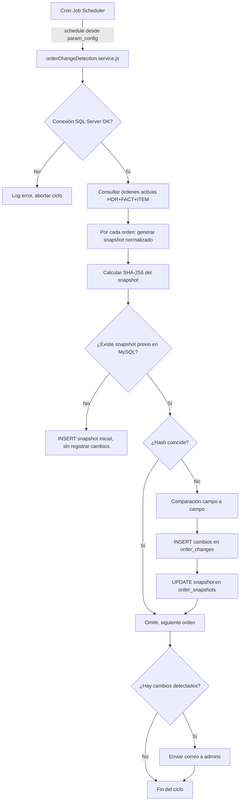
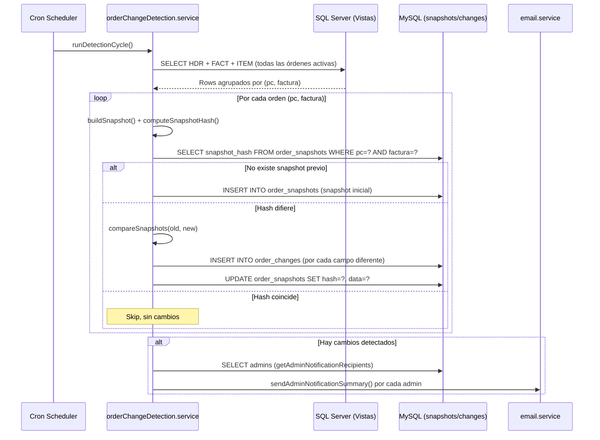

# Documento de Diseño: Detección de Cambios en Órdenes

## Visión General

Este diseño describe la implementación de un sistema de detección de cambios en órdenes que opera como cron job periódico. El sistema consulta las vistas de SQL Server (`jor_imp_HDR_90_softkey`, `jor_imp_FACT_90_softkey`, `jor_imp_item_90_softkey`), genera snapshots normalizados de cada orden, calcula hashes SHA-256 para comparación rápida, y cuando detecta diferencias, realiza una comparación campo a campo registrando los cambios en MySQL. Además, notifica por correo a los administradores y expone endpoints REST para consultar y reconocer cambios.

### Decisiones de Diseño Clave

1. **SHA-256 sobre MD5**: Se usa SHA-256 por ser más resistente a colisiones, y el costo computacional adicional es despreciable para este volumen de datos.
2. **Serialización determinista con claves ordenadas**: `JSON.stringify` con claves ordenadas garantiza que el mismo conjunto de datos siempre produzca el mismo hash, evitando falsos positivos.
3. **Reutilización de mappers existentes**: Se reutilizan `normalizeValue`, `normalizeDate`, `normalizeDecimal` de `Backend/mappers/sqlsoftkey/utils.js` para garantizar consistencia con el resto del sistema.
4. **Patrón de cron existente**: Se integra con `cronConfig.service.js` y `param_config` para configuración dinámica, igual que los demás cron jobs del sistema.
5. **Procesamiento tolerante a fallos**: Errores en una orden individual no detienen el ciclo completo.

## Arquitectura



## Componentes e Interfaces

### 1. `Backend/services/orderChangeDetection.service.js` (Nuevo)

Servicio principal que contiene toda la lógica de detección de cambios.

```javascript
// Interfaz pública del módulo
module.exports = {
  runDetectionCycle,        // Ejecuta un ciclo completo de detección
  buildSnapshot,            // Construye snapshot normalizado de una orden
  computeSnapshotHash,      // Calcula SHA-256 de un snapshot
  serializeSnapshot,        // Serialización determinista (claves ordenadas)
  compareSnapshots,         // Comparación campo a campo entre dos snapshots
  normalizeSnapshotValue,   // Normaliza un valor individual para el snapshot
};
```

#### `runDetectionCycle()`

Función principal que orquesta el ciclo completo:

1. Verifica conexión a SQL Server (si falla, aborta y loguea).
2. Consulta todas las órdenes activas desde SQL Server con una sola query que hace JOIN de HDR + FACT + ITEM.
3. Agrupa los resultados por `(pc, factura)` para formar la unidad de comparación.
4. Para cada grupo `(pc, factura)`:
   - Construye el snapshot normalizado con `buildSnapshot()`.
   - Calcula el hash con `computeSnapshotHash()`.
   - Busca el snapshot previo en `order_snapshots`.
   - Si no existe: INSERT del snapshot inicial (sin registrar cambios).
   - Si existe y el hash coincide: skip.
   - Si existe y el hash difiere: compara campo a campo con `compareSnapshots()`, inserta los cambios en `order_changes`, y actualiza `order_snapshots`.
5. Si hubo cambios, envía correo a administradores usando `sendAdminNotificationSummary`.
6. Loguea resumen: órdenes procesadas, cambios detectados, tiempo de ejecución.

#### `buildSnapshot(hdrData, factData, itemsData)`

Construye un objeto plano con todos los campos monitoreados, normalizados:

```javascript
// Estructura del snapshot
{
  // Campos HDR
  fecha_eta: normalizeDate(hdrData.ETA_OV),
  fecha_etd: normalizeDate(hdrData.ETD_OV),
  medio_envio_ov: normalizeValue(hdrData.MedioDeEnvioOV),
  incoterm: normalizeValue(hdrData.Clausula),
  puerto_destino: normalizeValue(hdrData.Puerto_Destino),
  puerto_embarque: normalizeValue(hdrData.Puerto_Embarque),
  estado_ov: normalizeValue(hdrData.EstadoOV),
  certificados: normalizeValue(hdrData.Certificados),
  gasto_adicional_flete: normalizeDecimal(hdrData.GtoAdicFlete, 4),
  fecha_incoterm: normalizeDate(hdrData.FechaOriginalCompromisoCliente),
  condicion_venta: normalizeValue(hdrData.Condicion_venta),
  nave: normalizeValue(hdrData.Nave),
  // Campos FACT
  fecha_eta_factura: normalizeDate(factData?.ETA_ENC_FA),
  fecha_etd_factura: normalizeDate(factData?.ETD_ENC_FA),
  medio_envio_factura: normalizeValue(factData?.MedioDeEnvioFact),
  gasto_adicional_flete_factura: normalizeDecimal(factData?.GtoAdicFleteFactura, 4),
  fecha_factura: normalizeDate(factData?.Fecha_factura),
  // Campos ITEM (array de items normalizados)
  items: itemsData.map(item => ({
    linea: item.Linea,
    kg_solicitados: normalizeDecimal(item.Cant_ordenada, 4),
    kg_despachados: normalizeDecimal(item.Cant_enviada, 4),
    kg_facturados: normalizeDecimal(item.KilosFacturados, 4),
    unit_price: normalizeDecimal(item.Precio_Unit, 4),
    fecha_etd: normalizeDate(item.ETD_Item_OV),
    fecha_eta: normalizeDate(item.ETA_Item_OV),
  })).sort((a, b) => (a.linea ?? 0) - (b.linea ?? 0))
}
```

Los items se ordenan por `linea` para garantizar determinismo.

#### `serializeSnapshot(snapshot)`

```javascript
function serializeSnapshot(snapshot) {
  return JSON.stringify(snapshot, Object.keys(snapshot).sort());
}
```

Para el array de items, se usa un replacer recursivo que ordena las claves en cada nivel del objeto. Esto garantiza que `JSON.stringify` produzca siempre la misma cadena para los mismos datos.

Implementación completa del replacer:

```javascript
function deterministicStringify(obj) {
  return JSON.stringify(obj, (key, value) => {
    if (value && typeof value === 'object' && !Array.isArray(value)) {
      const sorted = {};
      for (const k of Object.keys(value).sort()) {
        sorted[k] = value[k];
      }
      return sorted;
    }
    return value;
  });
}
```

#### `computeSnapshotHash(snapshot)`

```javascript
const crypto = require('crypto');

function computeSnapshotHash(snapshot) {
  const serialized = deterministicStringify(snapshot);
  return crypto.createHash('sha256').update(serialized, 'utf8').digest('hex');
}
```

#### `compareSnapshots(oldSnapshot, newSnapshot)`

Compara campo a campo entre dos snapshots y retorna un array de cambios:

```javascript
// Retorna: [{ field_name, old_value, new_value }]
```

Para campos escalares, compara directamente. Para el array de `items`, compara cada item por `linea`, y reporta cambios como `items[linea].campo`.

#### `normalizeSnapshotValue(value)`

Normaliza valores para evitar falsos positivos:
- `undefined`, `''`, `'null'`, `'undefined'` → `null`
- Strings: `.trim()`
- Fechas: formato `YYYY-MM-DD` via `normalizeDate`
- Decimales: precisión fija via `normalizeDecimal`

### 2. Integración con Cron (`Backend/services/cronConfig.service.js`)

El cron job se registra en `param_config` con el nombre `orderChangeDetection` (o similar), siguiendo el patrón existente:

```sql
INSERT INTO param_config (name, type, params) VALUES (
  'orderChangeDetection',
  'configuración',
  '{"enable": 1, "schedule": "*/30 * * * *"}'
);
```

En `app.js` se agrega el endpoint de cron:

```javascript
app.post('/api/cron/detect-order-changes', cronLimiter, detectOrderChangesController);
```

El scheduler externo (o node-cron interno) invoca este endpoint según el schedule configurado.

### 3. Controller: `Backend/controllers/orderChangeDetection.controller.js` (Nuevo)

```javascript
// POST /api/cron/detect-order-changes
async function detectOrderChanges(req, res) {
  // 1. Leer config desde param_config via getCronTasksConfig()
  // 2. Si está deshabilitado, retornar 200 con { skipped: true }
  // 3. Ejecutar runDetectionCycle()
  // 4. Retornar resumen { ordersProcessed, changesDetected, executionTimeMs }
}

// GET /api/order-changes/:pc
async function getOrderChanges(req, res) {
  // Retorna cambios no reconocidos para una orden (pc + factura opcional)
}

// POST /api/order-changes/:pc/acknowledge
async function acknowledgeOrderChanges(req, res) {
  // Marca cambios como reconocidos (acknowledged=1, acknowledged_by, acknowledged_at)
}

// GET /api/order-changes/summary
async function getChangeSummary(req, res) {
  // Retorna lista de órdenes con cambios no reconocidos (para badge en frontend)
}
```

### 4. Rutas: `Backend/routes/orderChangeDetection.routes.js` (Nuevo)

```javascript
const router = require('express').Router();
const controller = require('../controllers/orderChangeDetection.controller');

// Endpoint de consulta de cambios (protegido, admin)
router.get('/summary', controller.getChangeSummary);
router.get('/:pc', controller.getOrderChanges);
router.post('/:pc/acknowledge', controller.acknowledgeOrderChanges);

module.exports = router;
```

Registro en `app.js`:

```javascript
const orderChangeRoutes = require('./routes/orderChangeDetection.routes');
app.use('/api/order-changes', authMiddleware, readLimiter, authorizeRoles(['admin']), orderChangeRoutes);
```

### 5. Integración con Email (`Backend/services/email.service.js`)

Se reutiliza `sendAdminNotificationSummary` existente. El servicio de detección:

1. Obtiene la lista de admins con `getAdminNotificationRecipients()` de `user.service.js`.
2. Construye un `summaryText` con el detalle de cambios:
   ```
   Se detectaron cambios en 3 órdenes:

   📦 PC: 12345 | Factura: F-001
   - fecha_eta: 2025-01-15 → 2025-01-20
   - incoterm: FOB → CIF

   📦 PC: 12346 | Sin factura
   - estado_ov: En Proceso → Completada
   ```
3. Envía usando `sendAdminNotificationSummary` con el template `notifications-summary.hbs`.

## Modelos de Datos

### Tablas MySQL (ya definidas en requirements.md)

#### `order_snapshots`

| Campo | Tipo | Descripción |
|-------|------|-------------|
| id | INT AUTO_INCREMENT | PK |
| pc | VARCHAR(50) | Número de orden (Nro) |
| factura | VARCHAR(50) NULL | Número de factura (NULL si no tiene) |
| snapshot_hash | VARCHAR(64) | Hash SHA-256 del snapshot |
| snapshot_data | JSON | Snapshot completo en JSON |
| created_at | DATETIME | Fecha de creación |
| updated_at | DATETIME | Fecha de última actualización |

Índice único: `(pc, factura)` — identifica unívocamente cada orden.

#### `order_changes`

| Campo | Tipo | Descripción |
|-------|------|-------------|
| id | INT AUTO_INCREMENT | PK |
| pc | VARCHAR(50) | Número de orden |
| factura | VARCHAR(50) NULL | Número de factura |
| field_name | VARCHAR(100) | Campo que cambió |
| old_value | TEXT NULL | Valor anterior |
| new_value | TEXT NULL | Valor nuevo |
| acknowledged | TINYINT(1) | 0=no reconocido, 1=reconocido |
| acknowledged_by | INT NULL | ID del usuario que reconoció |
| acknowledged_at | DATETIME NULL | Fecha del reconocimiento |
| detected_at | DATETIME | Fecha de detección |

Índices: `(pc, factura)`, `(acknowledged)`, `(detected_at)`.

### Estructura del Snapshot (JSON)

```json
{
  "fecha_eta": "2025-01-15",
  "fecha_etd": "2025-01-10",
  "medio_envio_ov": "Marítimo",
  "incoterm": "FOB",
  "puerto_destino": "Shanghai",
  "puerto_embarque": "Valparaíso",
  "estado_ov": "En Proceso",
  "certificados": "Halal, Kosher",
  "gasto_adicional_flete": 150.5000,
  "fecha_incoterm": "2025-01-05",
  "condicion_venta": "30 días",
  "nave": "MSC Flaminia",
  "fecha_eta_factura": "2025-02-01",
  "fecha_etd_factura": "2025-01-20",
  "medio_envio_factura": "Marítimo",
  "gasto_adicional_flete_factura": 200.0000,
  "fecha_factura": "2025-01-12",
  "items": [
    {
      "linea": 1,
      "kg_solicitados": 1000.0000,
      "kg_despachados": 500.0000,
      "kg_facturados": 500.0000,
      "unit_price": 12.5000,
      "fecha_etd": "2025-01-10",
      "fecha_eta": "2025-01-15"
    }
  ]
}
```

### Flujo de Datos



## Manejo de Errores

### Errores de Conexión a SQL Server

- **Al inicio del ciclo**: Si `getSqlPool()` falla, se loguea el error y se aborta el ciclo completo. No se modifican datos en MySQL. El endpoint retorna HTTP 500 con detalle del error.
- **Durante procesamiento de una orden**: Se loguea el error con `pc` y `factura`, se incrementa un contador de errores, y se continúa con la siguiente orden.

### Errores de MySQL

- **Al leer snapshot previo**: Se loguea y se salta la orden (no se puede comparar sin el snapshot anterior).
- **Al escribir snapshot/cambios**: Se loguea con contexto completo (pc, factura, operación) y se continúa con la siguiente orden.
- **Al obtener admins para correo**: Se loguea y se omite el envío de correo (los cambios ya están registrados en la BD).

### Errores de Envío de Correo

- Si `sendAdminNotificationSummary` falla para un admin, se loguea y se continúa con el siguiente admin. Los cambios ya están persistidos en MySQL.

### Formato de Logs

Todos los logs usan el logger existente (`Backend/utils/logger.js`) con el prefijo `[OrderChangeDetection]`:

```javascript
logger.info('[OrderChangeDetection] Ciclo iniciado');
logger.info('[OrderChangeDetection] Procesadas: 150 órdenes, 5 cambios detectados, 2.3s');
logger.error('[OrderChangeDetection] Error procesando pc=12345 factura=F-001: <mensaje>');
logger.warn('[OrderChangeDetection] Error enviando correo a admin@example.com: <mensaje>');
```
