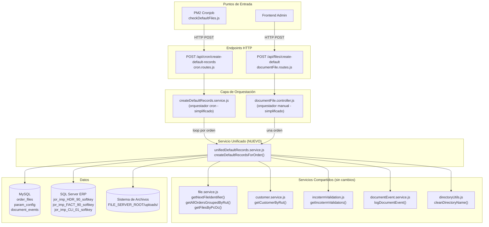
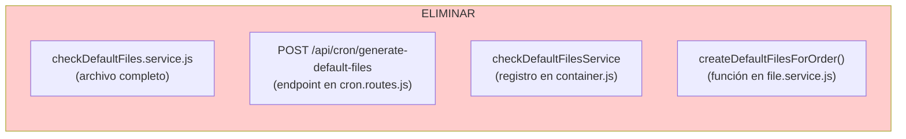
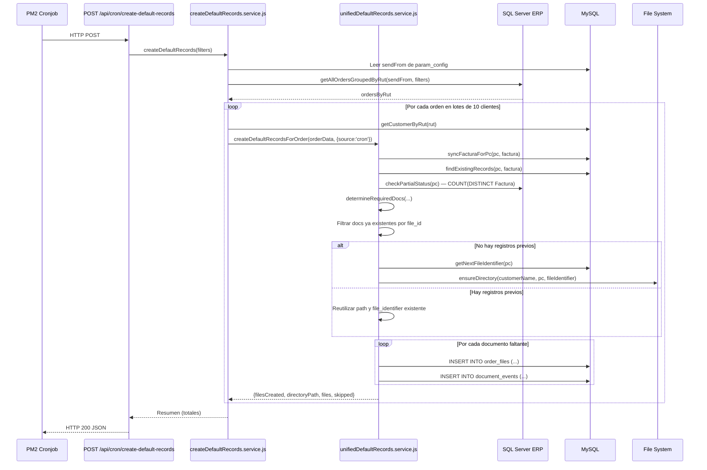
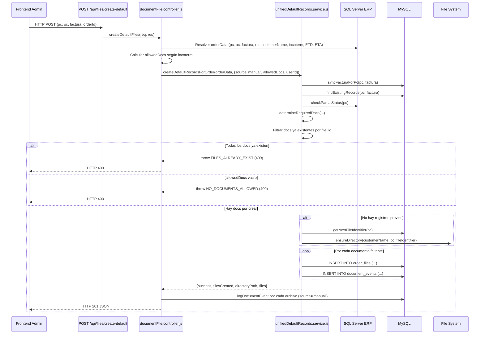

# Documento de Diseño — Unificación de Creación de Registros por Defecto

## Resumen

Este diseño describe la unificación de dos implementaciones activas de creación de registros por defecto en `order_files` en un único servicio reutilizable (`unifiedDefaultRecords.service.js`), junto con la eliminación del código muerto (`checkDefaultFiles.service.js`).

Actualmente existen inconsistencias entre el flujo cron (`createDefaultRecords.service.js`) y el flujo manual (`file.service.js → createDefaultFilesForPcOc`): formato de rutas diferente, lógica de parcialidad distinta, el cron guarda `rut` pero el manual no, y el cron sincroniza factura pero el manual no. El servicio unificado resolverá todas estas diferencias con una única función `createDefaultRecordsForOrder()` que ambos flujos invocarán.

## Arquitectura

### Diagrama de Arquitectura General



### Diagrama de Código Muerto a Eliminar



### Decisiones de Diseño

1. **Servicio unificado como archivo nuevo**: Se crea `unifiedDefaultRecords.service.js` en lugar de modificar uno existente, para facilitar la revisión de código y permitir rollback limpio.

2. **Orquestadores delgados**: `createDefaultRecords.service.js` se simplifica a un orquestador que itera órdenes y llama al servicio unificado. `documentFile.controller.js` se simplifica para llamar al servicio unificado directamente.

3. **Formato de ruta unificado con versionado**: Se adopta el formato `uploads/{CLIENTE}/{PC}_{N}` de `file.service.js` como estándar. El cron actualmente usa `uploads/{CLIENTE}/{PC}` sin sufijo — esto se corrige.

4. **Parcialidad por `invoice_count`**: Se adopta la lógica de `file.service.js` que cuenta facturas distintas en `jor_imp_FACT_90_softkey` (`COUNT(DISTINCT Factura)`) en lugar de la lógica del cron que usa `partialKeyCount` basado en filas del query.

5. **RUT siempre presente**: Ambos flujos guardarán `rut` en cada registro, resolviendo la inconsistencia del flujo manual.

6. **Sincronización de factura en ambos flujos**: La función `updateOrderReceiptNoticeFactura` se mueve al servicio unificado y se ejecuta en ambos flujos.


## Componentes e Interfaces

### 1. Servicio Unificado — `unifiedDefaultRecords.service.js` (NUEVO)

Archivo: `Backend/services/unifiedDefaultRecords.service.js`

#### Función principal: `createDefaultRecordsForOrder(orderData, options)`

```javascript
/**
 * Crea registros por defecto en order_files para una orden específica.
 * Función central que reemplaza la lógica duplicada en createDefaultRecords.service.js
 * y file.service.js (createDefaultFilesForPcOc).
 *
 * @param {Object} orderData
 * @param {string} orderData.pc              - Número de pedido de compra (requerido)
 * @param {string|null} orderData.oc         - Número de orden de compra del cliente
 * @param {string|null} orderData.factura    - Número de factura del ERP
 * @param {string|null} orderData.rut        - RUT del cliente
 * @param {string} orderData.customerName    - Nombre del cliente (para crear directorio)
 * @param {string|null} orderData.incoterm   - Cláusula incoterm de la orden
 * @param {string|null} orderData.fecha_etd_factura - Fecha ETD de la factura
 * @param {string|null} orderData.fecha_eta_factura - Fecha ETA de la factura
 *
 * @param {Object} [options={}]
 * @param {string} [options.source='cron']       - Origen: 'cron' | 'manual'
 * @param {string[]} [options.allowedDocs=null]  - Documentos permitidos (null = todos los aplicables)
 * @param {number|null} [options.userId=null]    - ID del usuario (flujo manual)
 *
 * @returns {Promise<{
 *   success: boolean,
 *   filesCreated: number,
 *   directoryPath: string,
 *   files: Array<{id: number, name: string, path: string}>,
 *   skipped: boolean
 * }>}
 *
 * @throws {Error} code='FILES_ALREADY_EXIST', status=409 (solo flujo manual)
 * @throws {Error} code='NO_DOCUMENTS_ALLOWED', status=400 (solo flujo manual, allowedDocs vacío)
 */
async function createDefaultRecordsForOrder(orderData, options = {}) { ... }
```

#### Funciones internas (privadas al módulo)

```javascript
/**
 * Sincroniza factura del ERP en registros ORN existentes con factura NULL.
 * @param {string} pc - Número PC
 * @param {string|null} factura - Factura del ERP
 * @returns {Promise<boolean>} true si se actualizó algún registro
 */
async function syncFacturaForPc(pc, factura) { ... }

/**
 * Busca registros existentes en order_files para un PC y factura.
 * Incluye registros con factura NULL para detectar ORNs pendientes.
 * @param {string} pc - Número PC
 * @param {string|null} factura - Factura normalizada
 * @returns {Promise<Array>} Registros existentes
 */
async function findExistingRecords(pc, factura) { ... }

/**
 * Determina si la orden es parcial consultando invoice_count en el ERP.
 * @param {string} pc - Número PC
 * @returns {Promise<{isPartial: boolean, invoiceCount: number}>}
 */
async function checkPartialStatus(pc) { ... }

/**
 * Determina los documentos requeridos según parcialidad, factura e incoterm.
 * @param {Object} params
 * @param {boolean} params.isPartial
 * @param {boolean} params.isParent
 * @param {boolean} params.hasFactura
 * @param {Object} params.order - Datos de la orden (para validación incoterm)
 * @param {string[]|null} params.allowedDocs - Restricción de documentos
 * @returns {Promise<string[]>} Nombres de documentos requeridos
 */
async function determineRequiredDocs(params) { ... }

/**
 * Crea el directorio físico con formato uploads/{CLIENTE}/{PC}_{N}.
 * @param {string} customerName - Nombre del cliente
 * @param {string} pc - Número PC
 * @param {number} fileIdentifier - Sufijo de versionado
 * @returns {Promise<string|null>} Ruta relativa o null si falla
 */
async function ensureDirectory(customerName, pc, fileIdentifier) { ... }

/**
 * Inserta un registro en order_files con valores por defecto estándar.
 * Registra evento en document_events.
 * @param {Object} fileData - Datos del registro
 * @param {Object} eventMeta - Metadatos para el evento (source, userId, etc.)
 * @returns {Promise<{insertId: number}>}
 */
async function insertRecord(fileData, eventMeta) { ... }
```

#### Exports

```javascript
module.exports = { createDefaultRecordsForOrder };
```

### 2. Orquestador Cron — `createDefaultRecords.service.js` (MODIFICAR)

Se simplifica drásticamente. Mantiene la responsabilidad de:
- Leer `sendFrom` de `param_config`
- Obtener órdenes agrupadas por RUT via `getAllOrdersGroupedByRut()`
- Iterar en lotes de 10 clientes
- Determinar orden padre (por `id` más bajo del mismo PC)
- Llamar a `createDefaultRecordsForOrder()` por cada orden
- Acumular contadores y loguear resumen

```javascript
// Firma sin cambios
async function createDefaultRecords(filters = {}) {
  // ... leer sendFrom, obtener ordersByRut, iterar en lotes ...
  for (const order of orders) {
    const result = await createDefaultRecordsForOrder(
      { pc: order.pc, oc: order.oc, factura: order.factura, rut, customerName: customer.name,
        incoterm: order.incoterm, fecha_etd_factura: order.fecha_etd_factura, fecha_eta_factura: order.fecha_eta_factura },
      { source: 'cron' }
    );
    // acumular contadores...
  }
}
module.exports = { createDefaultRecords };
```

Se eliminan de este archivo: `checkExistingFiles`, `insertDefaultFile`, `createClientDirectory`, `updateOrderReceiptNoticeFactura`.

### 3. Controlador Manual — `documentFile.controller.js` (MODIFICAR)

La función `createDefaultFiles` se simplifica para:
- Resolver datos de la orden (PC, OC, factura, customerName, rut, incoterm, ETD, ETA)
- Calcular `allowedDocs` según validación de incoterm
- Llamar a `createDefaultRecordsForOrder()` con `source: 'manual'`

```javascript
exports.createDefaultFiles = async (req, res) => {
  // ... resolver orderData desde params/body/SQL Server ...
  const result = await unifiedService.createDefaultRecordsForOrder(
    { pc, oc, factura, rut, customerName, incoterm, fecha_etd_factura, fecha_eta_factura },
    { source: 'manual', allowedDocs, userId: req.user?.id }
  );
  res.status(201).json(result);
};
```

### 4. Container DI — `container.js` (MODIFICAR)

```javascript
// AGREGAR
const unifiedDefaultRecordsService = require('../services/unifiedDefaultRecords.service');

// ELIMINAR
// const checkDefaultFilesService = require('../services/checkDefaultFiles.service');

container.register({
  // AGREGAR
  unifiedDefaultRecordsService: asValue(unifiedDefaultRecordsService),
  // ELIMINAR
  // checkDefaultFilesService: asValue(checkDefaultFilesService),
});
```

### 5. Rutas Cron — `cron.routes.js` (MODIFICAR)

```javascript
// ELIMINAR: import y endpoint de generate-default-files
// const { generateDefaultFiles } = container.resolve('checkDefaultFilesService');
// router.post('/generate-default-files', ...);

// MANTENER sin cambios:
// router.post('/create-default-records', ...);
```

### 6. `file.service.js` (MODIFICAR)

Se eliminan las funciones duplicadas:
- `createDefaultFilesForOrder()` — código muerto
- `createDefaultFilesForPcOc()` — reemplazada por servicio unificado
- `insertDefaultFile()` — movida al servicio unificado
- `createClientDirectory()` — movida al servicio unificado

Se mantienen (exportadas):
- `getNextFileIdentifier()` — usada por el servicio unificado
- `getAllOrdersGroupedByRut()` — usada por el orquestador cron
- `getFilesByPcOc()` — usada por el servicio unificado
- `getFilesByPc()`, `getFiles()`, `getFileById()`, `getFileByPath()`, etc.
- `insertFile()` — usada por otros flujos (upload)
- `createDefaultFilesIfNotExist()` — se actualiza para llamar al servicio unificado


## Modelos de Datos

### Tabla `order_files` (MySQL) — Sin cambios de esquema

| Campo | Tipo | Valor por defecto (servicio unificado) |
|---|---|---|
| `pc` | VARCHAR | Valor de `orderData.pc` |
| `oc` | VARCHAR | `orderData.oc` normalizado (trim) o NULL |
| `factura` | VARCHAR | Normalizado: `null`/`''`/`0`/`'0'` → NULL |
| `rut` | VARCHAR | `orderData.rut` (siempre presente si disponible) |
| `name` | VARCHAR | Nombre del documento (ej: `'Order Receipt Notice'`) |
| `path` | VARCHAR | `uploads/{CLIENTE}/{PC}_{N}` (relativa) |
| `file_identifier` | INT | Secuencial por PC (1, 2, 3...) |
| `file_id` | INT | 9=ORN, 19=Shipment, 15=Delivery, 6=Availability |
| `was_sent` | TINYINT | NULL |
| `document_type` | INT | 0 |
| `file_type` | VARCHAR | `'PDF'` |
| `status_id` | INT | 1 |
| `is_visible_to_client` | TINYINT | 0 |
| `created_at` | DATETIME | NOW() |
| `updated_at` | DATETIME | NOW() |

### Mapa de `file_id` por tipo de documento

```javascript
const FILE_ID_MAP = {
  'Order Receipt Notice': 9,
  'Shipment Notice': 19,
  'Order Delivery Notice': 15,
  'Availability Notice': 6
};
```

### Tabla `document_events` (MySQL) — Sin cambios de esquema

Cada inserción en `order_files` genera un evento:

| Campo | Valor |
|---|---|
| `source` | `'cron'` o `'manual'` |
| `action` | `'create_record'` |
| `process` | `'unifiedDefaultRecords'` |
| `file_id` | ID del registro insertado |
| `doc_type` | Nombre del documento |
| `pc`, `oc`, `factura` | Datos de la orden |
| `customer_rut` | RUT del cliente |
| `user_id` | ID del usuario (manual) o NULL (cron) |
| `status` | `'ok'` o `'error'` |
| `message` | Mensaje de error (si aplica) |

### Tabla `param_config` (MySQL) — Sin cambios

Configuración `checkDefaultFiles`:
```json
{
  "sendFrom": "2024-01-01"
}
```

Configuración `validateIncoternFile`:
```json
{
  "enable": 1,
  "incoterm": {
    "Shipment Notice": ["FOB", "CFR", "CIF"],
    "Availability Notice": ["EXW", "FCA"]
  }
}
```

### Flujo de Datos — Cron



### Flujo de Datos — Manual




## Propiedades de Correctitud

*Una propiedad es una característica o comportamiento que debe cumplirse en todas las ejecuciones válidas de un sistema — esencialmente, una declaración formal sobre lo que el sistema debe hacer. Las propiedades sirven como puente entre especificaciones legibles por humanos y garantías de correctitud verificables por máquina.*

### Propiedad 1: Determinación de documentos requeridos

*Para cualquier* orden con una combinación de `(isPartial, isParent, hasFactura)`, la función `determineRequiredDocs` debe retornar:
- Si `!isPartial && !hasFactura`: solo `['Order Receipt Notice']`
- Si `!isPartial && hasFactura`: `['Order Receipt Notice']` + documentos de factura aplicables
- Si `isPartial && isParent && !hasFactura`: solo `['Order Receipt Notice']`
- Si `isPartial && isParent && hasFactura`: `['Order Receipt Notice']` + documentos de factura aplicables
- Si `isPartial && !isParent`: solo documentos de factura aplicables (sin ORN)

**Validates: Requirements 5.1, 5.2, 5.3, 5.4, 5.5**

### Propiedad 2: Validación de incoterm y fechas bloquea documentos

*Para cualquier* orden, los documentos de factura deben cumplir:
- Shipment Notice solo se incluye si `fecha_etd_factura` Y `fecha_eta_factura` están presentes, y si la validación de incoterm está habilitada, el incoterm debe estar en la lista de `shipmentIncoterms`
- Order Delivery Notice solo se incluye si `fecha_eta_factura` está presente
- Availability Notice solo se incluye si la validación de incoterm está habilitada, el incoterm debe estar en la lista de `availabilityIncoterms`

**Validates: Requirements 6.2, 6.3, 6.4**

### Propiedad 3: Intersección de allowedDocs

*Para cualquier* conjunto de documentos requeridos y cualquier array `allowedDocs`, el resultado de `determineRequiredDocs` debe ser exactamente la intersección de ambos conjuntos. Si `allowedDocs` es `null`, se retornan todos los documentos requeridos.

**Validates: Requirements 6.5, 14.2**

### Propiedad 4: Formato de ruta con versionado

*Para cualquier* `customerName` y `pc` válidos, la ruta generada por `ensureDirectory` debe cumplir el patrón `uploads/{cleanedName}/{pc}_{N}` donde `{cleanedName}` es el resultado de `cleanDirectoryName(customerName)` y `{N}` es un entero positivo.

**Validates: Requirements 3.1, 3.5**

### Propiedad 5: Secuencia de file_identifier

*Para cualquier* PC, si el máximo `file_identifier` existente en `order_files` es `M`, entonces `getNextFileIdentifier(pc)` debe retornar `M + 1`. Si no existen registros, debe retornar `1`.

**Validates: Requirements 3.2, 3.3**

### Propiedad 6: Reutilización de ruta y file_identifier

*Para cualquier* `orderData` donde ya existan registros en `order_files` para el mismo `pc` y `factura`, el servicio unificado debe reutilizar la `path` y `file_identifier` del primer registro existente en lugar de generar nuevos.

**Validates: Requirements 3.4**

### Propiedad 7: Normalización de factura y OC

*Para cualquier* valor de `factura` en `{null, undefined, '', 0, '0'}`, el valor almacenado en `order_files` debe ser `NULL`. Para cualquier otro valor, debe ser `String(factura).trim()`. *Para cualquier* valor de `oc` en `{null, undefined}`, el valor almacenado debe ser `NULL`. Para cualquier otro valor, debe ser `String(oc).trim()`.

**Validates: Requirements 12.2, 12.3**

### Propiedad 8: Prevención de duplicados por file_id

*Para cualquier* `orderData`, si ya existe un registro en `order_files` con el mismo `pc`, `factura` y `file_id`, el servicio unificado no debe crear un nuevo registro para ese tipo de documento.

**Validates: Requirements 10.1**

### Propiedad 9: Sincronización de factura en ORN

*Para cualquier* PC donde existan registros ORN (file_id=9) con `factura=NULL` y la orden tenga una factura válida del ERP, la función `syncFacturaForPc` debe actualizar el campo `factura` de esos registros ORN.

**Validates: Requirements 9.1**

### Propiedad 10: Valores por defecto e identificador de documento

*Para cualquier* registro insertado por el servicio unificado, los valores deben ser: `was_sent=NULL`, `document_type=0`, `file_type='PDF'`, `status_id=1`, `is_visible_to_client=0`. Además, el `file_id` debe corresponder al mapa: ORN→9, Shipment→19, Delivery→15, Availability→6.

**Validates: Requirements 12.1, 12.4**


## Manejo de Errores

### Errores del Servicio Unificado

| Escenario | Código | Status HTTP | Comportamiento Cron | Comportamiento Manual |
|---|---|---|---|---|
| Todos los docs ya existen | `FILES_ALREADY_EXIST` | 409 | Omitir silenciosamente (`skipped: true`) | Lanzar error al controlador |
| `allowedDocs` vacío | `NO_DOCUMENTS_ALLOWED` | 400 | N/A (cron no usa allowedDocs) | Lanzar error al controlador |
| Fallo creando directorio | — | — | Log warning, omitir orden, continuar | Log warning, omitir orden, continuar |
| Fallo insertando registro | — | — | Log error, continuar con siguiente doc | Log error, continuar con siguiente doc |
| Cliente no encontrado | — | — | Log warning, omitir orden | Log warning, omitir orden |
| `pc` no proporcionado | `INVALID_ORDER_DATA` | 400 | No debería ocurrir (filtrado previo) | Lanzar error al controlador |

### Resiliencia en Flujo Cron

- Errores en una orden individual no detienen el procesamiento de las demás
- Cada error se registra en `document_events` con `status='error'`
- El resumen final incluye contadores de éxitos y errores

### Resiliencia en Flujo Manual

- Errores se propagan al controlador que responde con el status HTTP apropiado
- Cada error se registra en `document_events` con `status='error'`

## Estrategia de Testing

### Tests Unitarios (ejemplo)

- Verificar que `createDefaultRecordsForOrder` con `pc` faltante lanza error
- Verificar que en modo cron, `FILES_ALREADY_EXIST` retorna `skipped: true` sin lanzar error
- Verificar que en modo manual, `FILES_ALREADY_EXIST` lanza error con status 409
- Verificar que `allowedDocs` vacío en modo manual lanza `NO_DOCUMENTS_ALLOWED`
- Verificar que fallo de directorio omite la orden sin lanzar error
- Verificar que `syncFacturaForPc` se ejecuta antes de `findExistingRecords`
- Verificar que el evento `document_events` se registra con todos los campos requeridos

### Tests de Propiedad (property-based)

Librería: **fast-check** (ya disponible en el ecosistema Node.js)

Configuración: mínimo 100 iteraciones por propiedad.

Cada test de propiedad debe referenciar su propiedad del documento de diseño con el formato:
`Feature: unify-default-records-creation, Property {N}: {título}`

Propiedades a implementar:
1. Determinación de documentos requeridos (Propiedad 1)
2. Validación de incoterm y fechas (Propiedad 2)
3. Intersección de allowedDocs (Propiedad 3)
4. Formato de ruta con versionado (Propiedad 4)
5. Secuencia de file_identifier (Propiedad 5)
6. Reutilización de ruta/identifier (Propiedad 6)
7. Normalización de factura y OC (Propiedad 7)
8. Prevención de duplicados (Propiedad 8)
9. Sincronización de factura ORN (Propiedad 9)
10. Valores por defecto e ID de documento (Propiedad 10)

### Tests de Integración

- Endpoint `POST /api/cron/create-default-records` procesa órdenes correctamente
- Endpoint `POST /api/files/create-default` crea registros para una orden
- Ambos endpoints mantienen la misma firma HTTP (backward compatibility)

### Tests de Humo (smoke)

- `checkDefaultFiles.service.js` no existe en el proyecto
- `generateDefaultFiles` no tiene referencias en el código
- `checkDefaultFilesService` no está registrado en el container
- `createDefaultFilesForOrder` no está exportada en `file.service.js`
- `getNextFileIdentifier`, `getAllOrdersGroupedByRut`, `getFilesByPcOc` siguen exportadas en `file.service.js`
