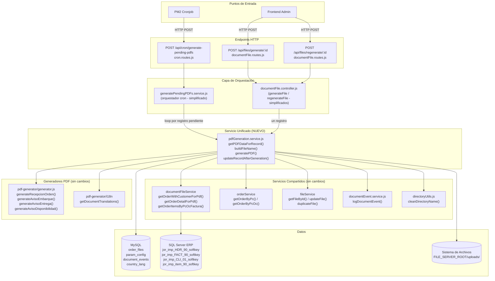
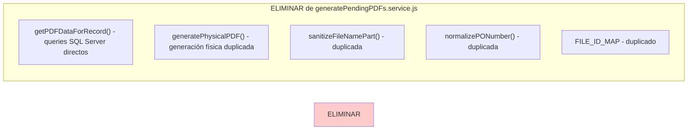
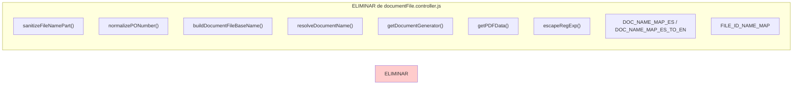
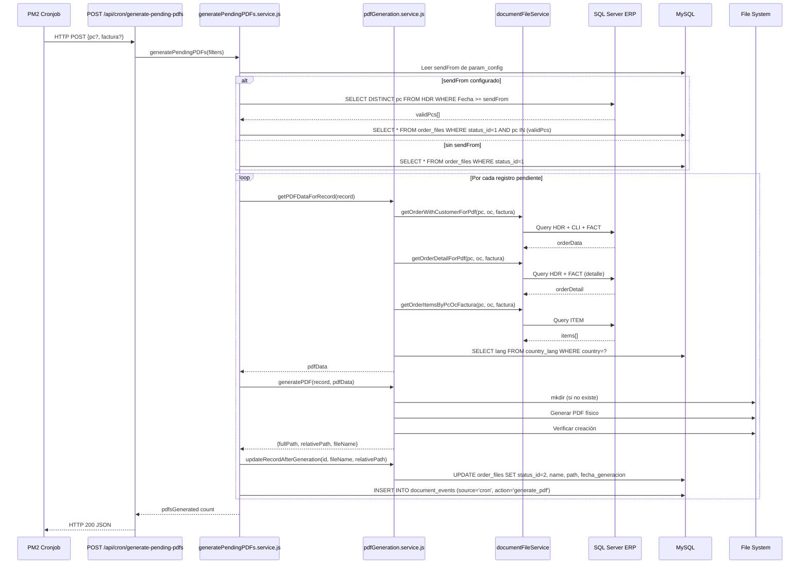
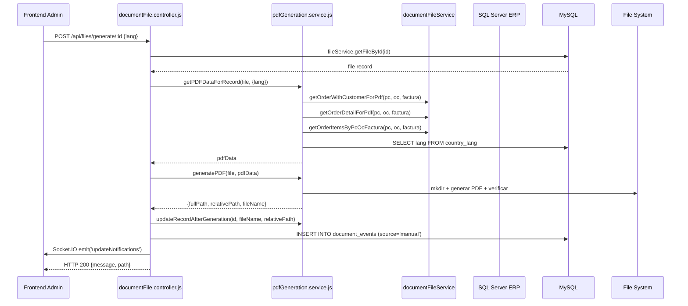

# Documento de Diseño — Unificación de Generación de PDFs

## Resumen

Este diseño describe la unificación de dos implementaciones de generación de PDFs (`generatePendingPDFs.service.js` para el cron y `documentFile.controller.js` para el flujo manual) en un único servicio reutilizable (`pdfGeneration.service.js`). Actualmente el cron obtiene datos directamente de SQL Server con queries propios, mientras que el flujo manual usa métodos de `documentFileService`. Ambos duplican funciones helper (`sanitizeFileNamePart`, `normalizePONumber`, `buildDocumentFileBaseName`, `resolveDocumentName`, `getDocumentGenerator`) y construyen el objeto de datos PDF de forma diferente, lo que puede producir PDFs inconsistentes para la misma entrada.

El servicio unificado adoptará los métodos de `documentFileService` como fuente estándar de datos, centralizará todas las funciones helper, y expondrá una API clara que ambos flujos invocarán. El cron se convertirá en un orquestador delgado (como se hizo con `createDefaultRecords.service.js`) y el controller delegará la generación al servicio unificado.

## Arquitectura

### Diagrama de Arquitectura General



### Código a Eliminar del Cron



### Código a Eliminar del Controller



### Decisiones de Diseño

1. **Servicio unificado como archivo nuevo**: Se crea `pdfGeneration.service.js` en lugar de modificar uno existente, para facilitar revisión de código y rollback limpio. Sigue el mismo patrón que `unifiedDefaultRecords.service.js`.

2. **`documentFileService` como fuente estándar de datos**: Se adoptan los métodos `getOrderWithCustomerForPdf`, `getOrderDetailForPdf` y `getOrderItemsByPcOcFactura` como la fuente única de datos. Esto elimina los queries SQL Server directos del cron (`getPDFDataForRecord`), que duplicaban la misma lógica con queries diferentes.

3. **Preservar `specificData` por tipo de documento**: La función `getPDFData` del controller tiene un objeto `specificData` con campos adicionales por tipo de documento (ej: `portOfShipment`, `vesselName` para Shipment Notice). Estos se preservan en el servicio unificado.

4. **Orquestador cron delgado**: `generatePendingPDFs.service.js` conserva solo: consulta de registros pendientes (`status_id = 1`), lectura de `sendFrom` de `param_config`, filtro por PCs válidos vía SQL Server, y el loop de procesamiento. Toda la lógica de obtención de datos, generación y actualización se delega al servicio unificado.

5. **Mantener `sendFrom` filter solo en cron**: El filtro `sendFrom` es específico del flujo cron y no aplica al flujo manual. Se mantiene en el orquestador cron.

6. **Versionado `_vN` solo en regeneración**: La lógica de sufijo `_vN` es exclusiva del `regenerateFile` y se implementa como función del servicio unificado (`buildVersionedFileName`).

## Componentes e Interfaces

### 1. Servicio Unificado — `pdfGeneration.service.js` (NUEVO)

Archivo: `Backend/services/pdfGeneration.service.js`

#### Constantes y Mapas

```javascript
const FILE_ID_NAME_MAP = {
  9: 'Order Receipt Notice',
  19: 'Shipment Notice',
  15: 'Order Delivery Notice',
  6: 'Availability Notice'
};

const DOC_NAME_MAP_ES = {
  'Order Receipt Notice': 'Aviso de Recepcion de Orden',
  'Shipment Notice': 'Aviso de Embarque',
  'Order Delivery Notice': 'Aviso de Entrega',
  'Availability Notice': 'Aviso de Disponibilidad de Orden'
};

const DOC_TRANSLATION_KEY_MAP = {
  'Order Receipt Notice': 'aviso_recepcion',
  'Shipment Notice': 'aviso_embarque',
  'Order Delivery Notice': 'aviso_entrega',
  'Availability Notice': 'aviso_disponibilidad'
};
```

#### Función principal: `getPDFDataForRecord(record, options)`

```javascript
/**
 * Obtiene todos los datos necesarios para generar un PDF a partir de un Order_File_Record.
 * Usa documentFileService como fuente principal, con fallback a orderService.
 *
 * @param {Object} record - Registro de order_files (debe tener pc, oc, factura, file_id)
 * @param {Object} [options={}]
 * @param {string} [options.lang=null] - Idioma forzado (fallback si no se resuelve por country_lang)
 * @returns {Promise<Object|null>} Objeto PDF_Data completo o null si no hay datos
 */
async function getPDFDataForRecord(record, options = {}) { ... }
```

#### Función: `buildFileName(record, pdfData, lang)`

```javascript
/**
 * Construye el nombre base del archivo PDF (sin extensión).
 * Patrón: {docName} - {customerName} - {PC} - PO {OC}
 * customerName se incluye solo cuando document_type === 0.
 *
 * @param {Object} record - Registro de order_files
 * @param {Object} pdfData - Datos del PDF (para customerName y orderNumber)
 * @param {string} lang - Idioma para el nombre del documento
 * @returns {string} Nombre base del archivo
 */
function buildFileName(record, pdfData, lang) { ... }
```

#### Función: `buildVersionedFileName(baseName, directoryPath)`

```javascript
/**
 * Construye un nombre de archivo versionado (_vN) basado en archivos existentes.
 *
 * @param {string} baseName - Nombre base sin extensión
 * @param {string} directoryPath - Ruta absoluta del directorio
 * @returns {string} Nombre con sufijo _vN (ej: "Aviso - Cliente - 123 - PO 456_v2")
 */
function buildVersionedFileName(baseName, directoryPath) { ... }
```

#### Función: `generatePDF(record, pdfData)`

```javascript
/**
 * Genera el archivo PDF físico en el servidor.
 * Crea el directorio si no existe, selecciona el generador correcto y verifica la creación.
 *
 * @param {Object} record - Registro de order_files (necesita pc, file_id, file_identifier, customer_name)
 * @param {Object} pdfData - Datos completos para el PDF
 * @returns {Promise<{fullPath: string, relativePath: string, fileName: string}|null>}
 */
async function generatePDF(record, pdfData) { ... }
```

#### Función: `updateRecordAfterGeneration(recordId, fileName, relativePath)`

```javascript
/**
 * Actualiza el registro en order_files después de generar el PDF exitosamente.
 * Establece status_id=2, name, path y fecha_generacion.
 *
 * @param {number} recordId - ID del registro en order_files
 * @param {string} fileName - Nombre base del archivo (sin extensión)
 * @param {string} relativePath - Ruta relativa al FILE_SERVER_ROOT
 * @returns {Promise<void>}
 */
async function updateRecordAfterGeneration(recordId, fileName, relativePath) { ... }
```

#### Funciones helper (privadas al módulo, exportadas para testing)

```javascript
function sanitizeFileNamePart(value) { ... }
function normalizePONumber(value) { ... }
function resolveDocumentName(file) { ... }
function getDocumentGenerator(documentName) { ... }
function getDocumentDisplayName(documentName, lang) { ... }
function escapeRegExp(value) { ... }
```

#### Función: `resolveLang(record, countryLangFromDB, fallbackLang)`

```javascript
/**
 * Resuelve el idioma para el PDF siguiendo la cadena:
 * 1. country_lang (consultado por país del cliente)
 * 2. record.lang (idioma del registro)
 * 3. fallbackLang (idioma del frontend o 'en')
 *
 * @param {string|null} countryLang - Idioma de country_lang
 * @param {string|null} recordLang - Idioma del registro
 * @param {string} [fallbackLang='en'] - Idioma por defecto
 * @returns {string} Idioma resuelto
 */
function resolveLang(countryLang, recordLang, fallbackLang = 'en') { ... }
```

#### Exports

```javascript
module.exports = {
  getPDFDataForRecord,
  buildFileName,
  buildVersionedFileName,
  generatePDF,
  updateRecordAfterGeneration,
  // Exportados para testing
  sanitizeFileNamePart,
  normalizePONumber,
  resolveDocumentName,
  getDocumentGenerator,
  getDocumentDisplayName,
  resolveLang,
  escapeRegExp,
  // Constantes exportadas para testing
  FILE_ID_NAME_MAP,
  DOC_NAME_MAP_ES,
  DOC_TRANSLATION_KEY_MAP
};
```

### 2. Orquestador Cron — `generatePendingPDFs.service.js` (MODIFICAR)

Se simplifica drásticamente. Mantiene la responsabilidad de:
- Leer `sendFrom` de `param_config`
- Consultar registros pendientes (`status_id = 1`) con filtros opcionales
- Filtrar por PCs válidos vía SQL Server cuando `sendFrom` está configurado
- Iterar registros y llamar al servicio unificado
- Registrar eventos de éxito/error
- Acumular contadores y loguear resumen

```javascript
const pdfGenerationService = require('./pdfGeneration.service');

async function generatePendingPDFs(filters = {}) {
  // ... leer sendFrom, consultar registros pendientes, filtrar por sendFrom ...
  for (const record of pendingRecords) {
    try {
      const pdfData = await pdfGenerationService.getPDFDataForRecord(record);
      if (!pdfData) { /* log warning, continue */ }

      const pdfResult = await pdfGenerationService.generatePDF(record, pdfData);
      if (!pdfResult) { /* log error, continue */ }

      await pdfGenerationService.updateRecordAfterGeneration(
        record.id, pdfResult.fileName, pdfResult.relativePath
      );

      await logDocumentEvent({ source: 'cron', action: 'generate_pdf', ... });
      pdfsGenerated++;
    } catch (err) {
      await logDocumentEvent({ source: 'cron', status: 'error', message: err.message, ... });
      continue;
    }
  }
  return pdfsGenerated;
}
```

Se eliminan de este archivo: `getPDFDataForRecord`, `generatePhysicalPDF`, `sanitizeFileNamePart`, `normalizePONumber`, `FILE_ID_MAP`.

### 3. Controller — `documentFile.controller.js` (MODIFICAR)

#### `generateFile` simplificado

```javascript
const pdfGenerationService = container.resolve('pdfGenerationService');

exports.generateFile = async (req, res) => {
  const { id } = req.params;
  const { lang: frontendLang = 'es' } = req.body;

  try {
    const file = await fileService.getFileById(id);
    if (!file) return res.status(404).json({ message: t('documentFile.file_not_found', req.lang || 'es') });

    const pdfData = await pdfGenerationService.getPDFDataForRecord(file, { lang: frontendLang });
    if (!pdfData) return res.status(500).json({ message: t('documentFile.generate_file_error', req.lang || 'es') });

    const pdfResult = await pdfGenerationService.generatePDF(file, pdfData);
    if (!pdfResult) return res.status(500).json({ message: t('documentFile.generate_file_error', req.lang || 'es') });

    await pdfGenerationService.updateRecordAfterGeneration(file.id, pdfResult.fileName, pdfResult.relativePath);

    await logDocEvent({ source: 'manual', action: 'generate_pdf', process: 'generateFile', ... });
    const io = req.app.get('io');
    if (io) io.to('admin-room').emit('updateNotifications');
    return res.json({ message: t('documentFile.file_generated', req.lang || 'es'), path: pdfResult.relativePath });
  } catch (error) {
    return res.status(500).json({ message: t('documentFile.generate_file_error', req.lang || 'es') });
  }
};
```

#### `regenerateFile` simplificado

```javascript
exports.regenerateFile = async (req, res) => {
  const { id } = req.params;
  const { lang: frontendLang = 'es' } = req.body;

  try {
    const file = await fileService.getFileById(id);
    if (!file) return res.status(404).json({ message: t('documentFile.file_not_found', req.lang || 'es') });

    const pdfData = await pdfGenerationService.getPDFDataForRecord(file, { lang: frontendLang });
    if (!pdfData) return res.status(500).json({ message: t('documentFile.regenerate_error', req.lang || 'es') });

    // Construir nombre base y versionado
    const lang = pdfData.lang;
    const baseName = pdfGenerationService.buildFileName(file, pdfData, lang);

    const FILE_SERVER_ROOT = process.env.FILE_SERVER_ROOT || '/var/www/html';
    const cleanCustomerName = cleanDirectoryName(file.customer_name);
    const cleanFolderName = cleanDirectoryName(file.pc);
    const folderName = file.file_identifier ? `${cleanFolderName}_${file.file_identifier}` : cleanFolderName;
    const customerFolder = path.join(FILE_SERVER_ROOT, 'uploads', cleanCustomerName, folderName);

    if (!fs.existsSync(customerFolder)) fs.mkdirSync(customerFolder, { recursive: true });

    const versionedName = pdfGenerationService.buildVersionedFileName(baseName, customerFolder);
    const fileName = `${versionedName}.pdf`;
    const filePath = path.join(customerFolder, fileName);

    // Generar PDF con el generador correcto
    const documentName = pdfGenerationService.resolveDocumentName(file);
    const generator = pdfGenerationService.getDocumentGenerator(documentName);
    await generator(filePath, pdfData);

    const newFileId = await fileService.duplicateFile(id, path.relative(FILE_SERVER_ROOT, filePath), versionedName);

    await logDocEvent({ source: 'manual', action: 'regenerate_pdf', process: 'regenerateFile', fileId: newFileId, ... });
    res.json({ message: t('documentFile.document_regenerated', req.lang || 'es'), fileName, filePath: path.relative(FILE_SERVER_ROOT, filePath), newFileId });
  } catch (err) {
    res.status(500).json({ message: t('documentFile.regenerate_error', req.lang || 'es') });
  }
};
```

Se eliminan del controller: `sanitizeFileNamePart`, `normalizePONumber`, `buildDocumentFileBaseName`, `resolveDocumentName`, `getDocumentGenerator`, `getDocumentDisplayName`, `getPDFData`, `escapeRegExp`, `DOC_NAME_MAP_ES`, `DOC_NAME_MAP_ES_TO_EN`, `FILE_ID_NAME_MAP`.

### 4. Container DI — `container.js` (MODIFICAR)

```javascript
// AGREGAR
const pdfGenerationService = require('../services/pdfGeneration.service');

container.register({
  // AGREGAR
  pdfGenerationService: asValue(pdfGenerationService),
  // ... resto sin cambios ...
});
```

## Modelos de Datos

### Tabla `order_files` (MySQL) — Sin cambios de esquema

Campos relevantes para la generación de PDFs:

| Campo | Tipo | Descripción |
|---|---|---|
| `id` | INT | PK, auto-increment |
| `pc` | VARCHAR | Número de pedido de compra |
| `oc` | VARCHAR | Número de orden del cliente |
| `factura` | VARCHAR | Número de factura |
| `rut` | VARCHAR | RUT del cliente |
| `name` | VARCHAR | Nombre base del archivo (sin extensión) |
| `path` | VARCHAR | Ruta relativa al FILE_SERVER_ROOT |
| `file_identifier` | INT | Identificador secuencial por PC |
| `file_id` | INT | 9=ORN, 19=Shipment, 15=Delivery, 6=Availability |
| `document_type` | INT | 0=generado, 1=subido manualmente |
| `status_id` | INT | 1=pendiente, 2=generado |
| `fecha_generacion` | DATETIME | Fecha de generación del PDF |
| `is_visible_to_client` | TINYINT | Visibilidad para el cliente |
| `lang` | VARCHAR | Idioma del registro (puede ser NULL) |
| `customer_name` | VARCHAR | Nombre del cliente (JOIN) |
| `customer_rut` | VARCHAR | RUT del cliente (JOIN) |

### Mapa de `file_id` a generador

| file_id | Nombre documento | Generador | Template |
|---|---|---|---|
| 9 | Order Receipt Notice | `generateRecepcionOrden` | `aviso-recepcion-orden.hbs` |
| 19 | Shipment Notice | `generateAvisoEmbarque` | `aviso-embarque.hbs` |
| 15 | Order Delivery Notice | `generateAvisoEntrega` | `aviso-entrega.hbs` |
| 6 | Availability Notice | `generateAvisoDisponibilidad` | `aviso-disponibilidad.hbs` |

### Mapa de `file_id` a translation key

| file_id | Translation Key |
|---|---|
| 9 | `aviso_recepcion` |
| 19 | `aviso_embarque` |
| 15 | `aviso_entrega` |
| 6 | `aviso_disponibilidad` |

### Estructura del objeto PDF_Data

```javascript
{
  // Campos base (todos los tipos)
  title: String,              // Nombre del documento
  subtitle: String,           // Subtítulo descriptivo
  customerName: String,       // Nombre del cliente
  internalOrderNumber: String,// PC
  orderNumber: String,        // OC sin prefijo GEL
  tipo: String,               // Tipo de orden
  destinationPort: String,    // Puerto de destino
  incoterm: String,           // Cláusula incoterm
  shippingMethod: String,     // Medio de envío (factura o OV según hasFactura)
  etd: String|null,           // Fecha ETD
  eta: String|null,           // Fecha ETA
  currency: String,           // Moneda
  paymentCondition: String,   // Condición de venta
  additionalCharge: Number|null, // Gasto adicional flete
  hasFactura: Boolean,        // Si tiene factura válida
  incotermDeliveryDate: String, // Semana del año de fecha incoterm
  signImagePath: String|null, // Ruta de imagen de firma
  lang: String,               // Idioma resuelto
  translations: Object,       // Traducciones del documento
  items: Array<{              // Items de la orden
    descripcion: String,
    kg_solicitados: Number,
    kg_facturados: Number,
    unit_price: Number,
    factura: String
  }>,

  // Campos específicos por tipo (ver specificData en getPDFDataForRecord)
  // Order Receipt Notice: processingStatus, serviceType, origin, destination, priority
  // Shipment Notice: portOfShipment, vesselName, containerNumber, totalWeight, totalVolume
  // Order Delivery Notice: factura (del detalle)
  // Availability Notice: processingStatus, serviceType, origin, destination, priority
}
```

### Flujo de Datos — Cron



### Flujo de Datos — Manual (generateFile)




## Propiedades de Correctitud

*Una propiedad es una característica o comportamiento que debe cumplirse en todas las ejecuciones válidas de un sistema — esencialmente, una declaración formal sobre lo que el sistema debe hacer. Las propiedades sirven como puente entre especificaciones legibles por humanos y garantías de correctitud verificables por máquina.*

### Propiedad 1: Completitud y correctitud del objeto PDF_Data

*Para cualquier* Order_File_Record válido con `file_id` en `{9, 19, 15, 6}` y datos de orden disponibles, `getPDFDataForRecord` debe retornar un objeto que contenga todos los campos base requeridos (`title`, `customerName`, `internalOrderNumber`, `orderNumber`, `items`, `translations`, `lang`). Además:
- Cuando `factura` es no nula y no vacía, `shippingMethod` debe priorizar `medio_envio_factura` y `additionalCharge` debe usar `gasto_adicional_flete_factura`.
- Cuando `factura` es nula/vacía, `shippingMethod` debe priorizar `medio_envio_ov` y `additionalCharge` debe usar `gasto_adicional_flete`.
- Los campos específicos por tipo de documento deben estar presentes según el `file_id` (ej: `portOfShipment` para Shipment Notice).
- Las traducciones deben corresponder al translation key del tipo de documento y al idioma resuelto.

**Validates: Requirements 1.1, 1.4, 1.8, 1.9**

### Propiedad 2: Resolución de idioma

*Para cualquier* combinación de `(countryLang, recordLang, fallbackLang)`, la función `resolveLang` debe retornar:
- `countryLang` si es un string no vacío
- `recordLang` si `countryLang` es nulo/vacío y `recordLang` es un string no vacío
- `fallbackLang` (o `'en'` por defecto) si ambos anteriores son nulos/vacíos

**Validates: Requirements 1.7, 6.2**

### Propiedad 3: Construcción de nombres de archivo

*Para cualquier* combinación de `(docName, customerName, pc, oc, document_type)`:
- El nombre resultante de `buildFileName` nunca debe contener caracteres prohibidos en sistemas de archivos (`<>:"/\|?*`) ni caracteres de control.
- Cuando `document_type === 0`, el nombre debe incluir `customerName` como parte; cuando `document_type !== 0`, debe omitirlo.
- El número de orden (OC) debe aparecer sin el prefijo `GEL`.
- Si `oc` resulta vacío o `'-'` después de normalizar, la parte `PO {OC}` debe omitirse del nombre.
- Si `pc` está vacío, la parte de PC debe omitirse del nombre.

**Validates: Requirements 2.2, 2.3, 2.4, 2.5**

### Propiedad 4: Construcción de ruta de directorio

*Para cualquier* `customerName`, `pc` y `file_identifier` válidos, la ruta generada por `generatePDF` debe cumplir el patrón `uploads/{cleanDirectoryName(customerName)}/{cleanDirectoryName(pc)}_{file_identifier}`. Cuando `file_identifier` es nulo o indefinido, el patrón debe ser `uploads/{cleanDirectoryName(customerName)}/{cleanDirectoryName(pc)}`.

**Validates: Requirements 3.2**

### Propiedad 5: Selección de generador por file_id

*Para cualquier* `file_id` en `{9, 19, 15, 6}`, `getDocumentGenerator(resolveDocumentName({file_id}))` debe retornar la función generadora correspondiente: 9→`generateRecepcionOrden`, 19→`generateAvisoEmbarque`, 15→`generateAvisoEntrega`, 6→`generateAvisoDisponibilidad`. Para cualquier `file_id` fuera de ese conjunto, `generatePDF` debe retornar `null`.

**Validates: Requirements 3.4, 3.5**

### Propiedad 6: Cálculo de versión para regeneración

*Para cualquier* conjunto de archivos existentes en un directorio con patrón `{baseName}_v{N}.pdf`, `buildVersionedFileName(baseName, directoryPath)` debe retornar `{baseName}_v{M}` donde `M = max(N existentes) + 1`. Si no existen archivos versionados, debe retornar `{baseName}_v1`.

**Validates: Requirements 7.2**

## Manejo de Errores

### Errores del Servicio Unificado

| Escenario | Comportamiento Cron | Comportamiento Manual |
|---|---|---|
| `getPDFDataForRecord` retorna `null` | Log warning, continuar con siguiente registro | Retornar HTTP 500 |
| `generatePDF` retorna `null` (file_id desconocido) | Log error, continuar con siguiente registro | Retornar HTTP 500 |
| Error en generador de PDF (pdfkit) | Log error, registrar evento error, continuar | Retornar HTTP 500 |
| Directorio no se puede crear | Log error, continuar con siguiente registro | Retornar HTTP 500 |
| Archivo no se creó después de generación | Log error, continuar con siguiente registro | Retornar HTTP 500 |
| `fileService.getFileById` retorna null | N/A (cron usa query directo) | Retornar HTTP 404 |
| Error en `updateRecordAfterGeneration` | Log error, continuar | Retornar HTTP 500 |
| Error en `fileService.duplicateFile` (regeneración) | N/A | Retornar HTTP 500 |

### Resiliencia en Flujo Cron

- Errores en un registro individual no detienen el procesamiento de los demás
- Cada error se registra en `document_events` con `status='error'` y el mensaje de error
- El resumen final incluye el conteo de PDFs generados exitosamente vs total de pendientes
- Si `sendFrom` no se puede leer de `param_config`, se procesa sin filtro de fecha (con warning)

### Resiliencia en Flujo Manual

- Errores se propagan al controller que responde con el status HTTP apropiado
- Cada generación exitosa registra evento en `document_events` con `source='manual'`
- Cada error registra evento en `document_events` con `status='error'`

## Estrategia de Testing

### Tests Unitarios (ejemplo)

- Verificar que `getPDFDataForRecord` con record sin datos en documentFileService usa fallback a orderService
- Verificar que `getPDFDataForRecord` retorna `null` cuando ambas fuentes fallan
- Verificar que `generatePDF` retorna `null` para `file_id` desconocido
- Verificar que `updateRecordAfterGeneration` ejecuta el UPDATE correcto
- Verificar que el cron continúa procesando cuando un registro falla
- Verificar que `regenerateFile` llama a `duplicateFile` con la ruta correcta
- Verificar que `generateFile` emite `updateNotifications` vía Socket.IO

### Tests de Propiedad (property-based)

Librería: **fast-check** (ya disponible en el ecosistema Node.js)

Configuración: mínimo 100 iteraciones por propiedad.

Cada test de propiedad debe referenciar su propiedad del documento de diseño con el formato:
`Feature: unify-pdf-generation, Property {N}: {título}`

Propiedades a implementar:
1. Completitud y correctitud del objeto PDF_Data (Propiedad 1)
2. Resolución de idioma (Propiedad 2)
3. Construcción de nombres de archivo (Propiedad 3)
4. Construcción de ruta de directorio (Propiedad 4)
5. Selección de generador por file_id (Propiedad 5)
6. Cálculo de versión para regeneración (Propiedad 6)

### Tests de Integración

- Endpoint `POST /api/cron/generate-pending-pdfs` procesa registros pendientes correctamente
- Endpoint `POST /api/files/generate/:id` genera PDF para un registro específico
- Endpoint `POST /api/files/regenerate/:id` crea versión nueva con sufijo `_vN`
- Ambos endpoints mantienen la misma firma HTTP (backward compatibility)

### Tests de Humo (smoke)

- `getPDFDataForRecord` no existe en `generatePendingPDFs.service.js`
- `generatePhysicalPDF` no existe en `generatePendingPDFs.service.js`
- `sanitizeFileNamePart` no existe en `documentFile.controller.js`
- `normalizePONumber` no existe en `documentFile.controller.js`
- `buildDocumentFileBaseName` no existe en `documentFile.controller.js`
- `getPDFData` no existe en `documentFile.controller.js`
- `pdfGenerationService` está registrado en `container.js`
