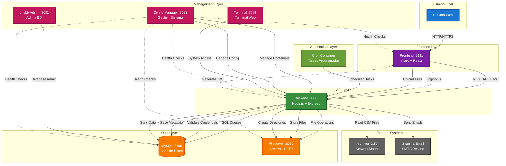
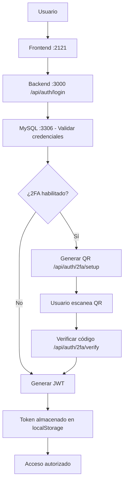
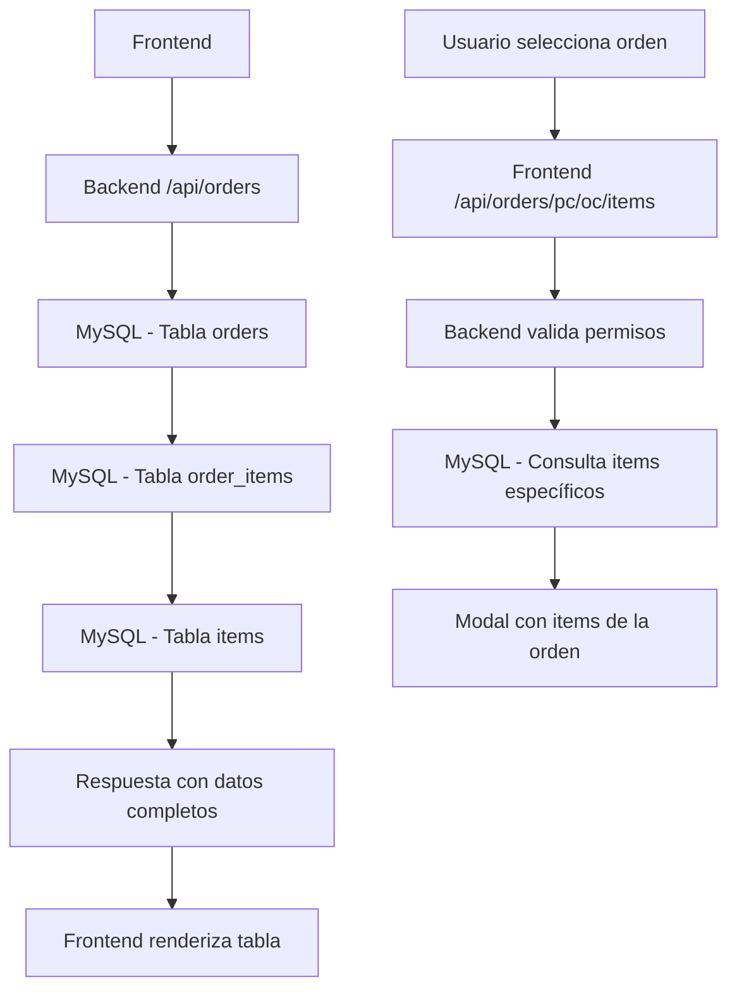
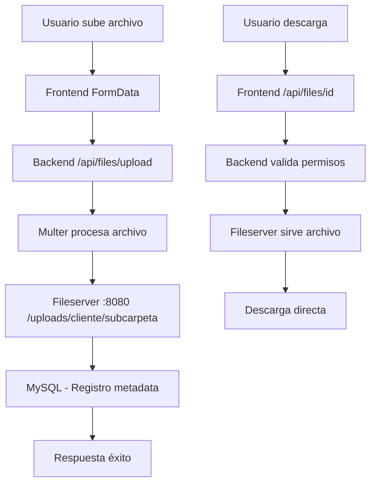
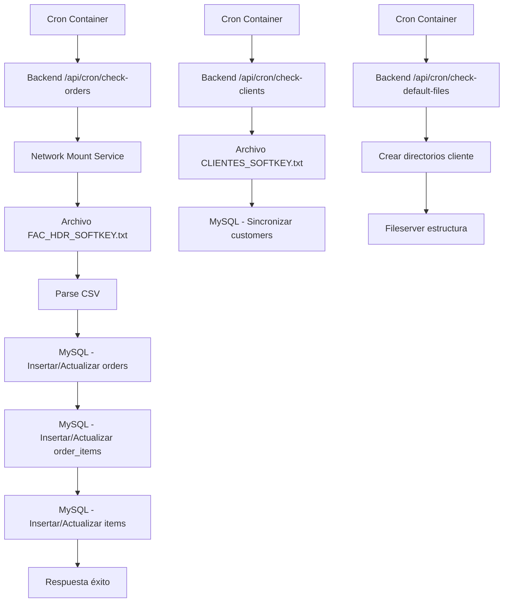
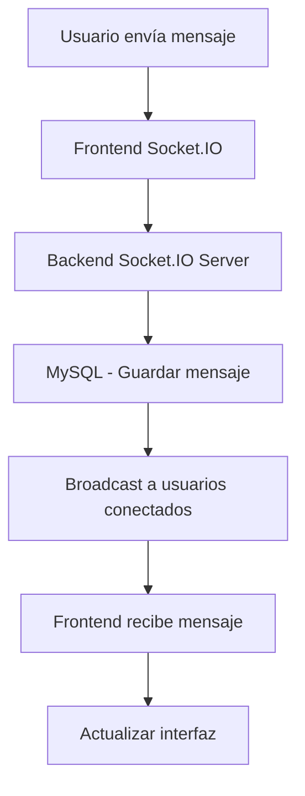
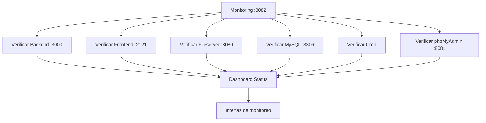

# Flujos del Sistema Gelymar Management Platform

## Arquitectura General

El sistema está compuesto por **8 contenedores principales** que interactúan entre sí para proporcionar una plataforma completa de gestión logística marina.

### Contenedores del Sistema

| Contenedor | Puerto | Función | Dependencias |
|------------|--------|---------|--------------|
| **mysql** | 3306 | Base de datos principal | - |
| **backend** | 3000 | API REST y lógica de negocio | mysql, fileserver |
| **frontend** | 2121 | Interfaz web (Astro + React) | backend |
| **fileserver** | 8080, 21 | Servidor de archivos (HTTP/FTP) | mysql |
| **cron** | - | Tareas programadas y sincronización | backend, fileserver |
| **phpmyadmin** | 8081 | Administración de BD | mysql |
| **monitoring** | 8082 | Dashboard de monitoreo | todos |
| **terminal** | 7681 | Terminal web | - |
| **config-manager** | 8083 | Gestión de configuración | todos |

---

## Flujo General del Sistema



### Descripción del Flujo General

**1. Capa de Usuario**
- Usuario accede vía navegador web a la interfaz

**2. Capa Frontend**
- Interfaz web construida con Astro + React
- Maneja autenticación, formularios y visualización de datos
- Comunicación con backend vía REST API

**3. Capa API**
- Backend Node.js que procesa toda la lógica de negocio
- Autenticación JWT y 2FA
- Validación de permisos y roles
- Comunicación con base de datos y fileserver

**4. Capa de Datos**
- MySQL: Almacena toda la información estructurada
- Fileserver: Gestiona archivos y documentos
- Volúmenes Docker para persistencia

**5. Capa de Gestión**
- Config Manager: Administración del sistema completo
- phpMyAdmin: Administración de base de datos
- Terminal: Acceso directo al sistema

**6. Capa de Automatización**
- Cron: Tareas programadas de sincronización
- Lectura de archivos CSV externos
- Mantenimiento automático del sistema

**7. Sistemas Externos**
- Archivos CSV en network mount para sincronización
- Sistema de email para notificaciones

---

## Flujos Principales del Sistema

### 1. Flujo de Autenticación y Autorización



**Endpoints clave:**
- `POST /api/auth/login` - Autenticación inicial
- `GET /api/auth/2fa/setup` - Generar QR para 2FA
- `GET /api/auth/2fa/status` - Verificar estado 2FA
- `POST /api/auth/2fa/verify` - Verificar código TOTP

### 2. Flujo de Gestión de Órdenes



**Endpoints clave:**
- `GET /api/orders` - Listar todas las órdenes
- `GET /api/orders/{pc}/{oc}/items` - Items de orden específica
- `GET /api/orders/{pc}/{oc}/{factura}/items` - Items con factura

### 3. Flujo de Gestión de Archivos



**Endpoints clave:**
- `POST /api/files/upload` - Subir archivos
- `GET /api/files/{customerUuid}/{folderId}` - Listar archivos
- `GET /api/files/{id}` - Descargar archivo específico
- `POST /api/files/generate/{id}` - Generar PDF

### 4. Flujo de Sincronización de Datos (Cron)



**Tareas programadas:**
- `checkOrders` - Sincronizar órdenes desde archivo CSV
- `checkClients` - Sincronizar clientes
- `checkItems` - Sincronizar items/productos
- `checkDefaultFiles` - Crear estructura de directorios

### 5. Flujo de Chat en Tiempo Real



**Endpoints clave:**
- `POST /api/chat/send` - Enviar mensaje
- `GET /api/chat/messages` - Obtener historial
- Socket.IO para comunicación en tiempo real

### 6. Flujo de Monitoreo del Sistema



---

## Interacciones Entre Contenedores

### Backend ↔ MySQL
- **Conexión**: Pool de conexiones MySQL2
- **Operaciones**: CRUD en todas las tablas del sistema
- **Autenticación**: Validación de usuarios y roles
- **Datos**: Órdenes, clientes, archivos, usuarios, chat

### Backend ↔ Fileserver
- **Conexión**: Volumen compartido `/var/www/html`
- **Operaciones**: Subida, descarga y gestión de archivos
- **Estructura**: `/uploads/{cliente}/{subcarpeta}/archivo.pdf`
- **Permisos**: Control de acceso por cliente y rol

### Frontend ↔ Backend
- **Conexión**: HTTP/HTTPS REST API
- **Autenticación**: JWT Bearer tokens
- **Endpoints**: Más de 50 endpoints REST
- **WebSocket**: Chat en tiempo real

### Cron ↔ Backend
- **Conexión**: HTTP requests a endpoints internos
- **Propósito**: Sincronización de datos externos
- **Frecuencia**: Tareas programadas con node-cron
- **Datos**: Órdenes, clientes, items desde archivos CSV

### Monitoring ↔ Todos
- **Conexión**: Health checks HTTP
- **Propósito**: Supervisión del estado del sistema
- **Alertas**: Notificaciones de servicios caídos
- **Dashboard**: Interfaz web de monitoreo

---

## Flujos de Datos Específicos

### Gestión de Clientes
1. **Sincronización**: Cron lee `CLIENTES_SOFTKEY.txt` → Backend → MySQL
2. **Consulta**: Frontend → Backend `/api/customers` → MySQL
3. **Permisos**: Clientes solo ven sus propias órdenes y archivos

### Gestión de Órdenes
1. **Sincronización**: Cron lee `FAC_HDR_SOFTKEY.txt` → Backend → MySQL
2. **Consulta**: Frontend → Backend `/api/orders` → MySQL
3. **Items**: Frontend → Backend `/api/orders/{pc}/{oc}/items` → MySQL
4. **Archivos**: Cada orden tiene su directorio en Fileserver

### Gestión de Archivos
1. **Subida**: Frontend → Backend → Fileserver + MySQL metadata
2. **Descarga**: Frontend → Backend → Fileserver (con validación de permisos)
3. **Generación**: Backend genera PDFs dinámicos usando datos de MySQL
4. **Estructura**: `/uploads/{cliente}/{pc-oc}/archivo.pdf`

### Sistema de Chat
1. **Envío**: Frontend → Backend Socket.IO → MySQL
2. **Recepción**: Backend Socket.IO → Frontend (broadcast)
3. **Historial**: Frontend → Backend `/api/chat/messages` → MySQL

---

## Configuración de Red

### Red Docker: `gelymar-network-dev`
- **Tipo**: Bridge network
- **Comunicación**: Todos los contenedores pueden comunicarse por nombre
- **Aislamiento**: Red privada para el sistema

### Puertos Expuestos
- **Frontend**: 2121 (HTTP)
- **Backend**: 3000 (HTTP)
- **Fileserver**: 8080 (HTTP), 21 (FTP)
- **MySQL**: 3306 (MySQL)
- **phpMyAdmin**: 8081 (HTTP)
- **Monitoring**: 8082 (HTTP)
- **Terminal**: 7681 (HTTP)
- **Config Manager**: 8083 (HTTP)

---

## Variables de Entorno Críticas

### Backend
- `DB_HOST`, `DB_USER`, `DB_PASS`, `DB_NAME` - Conexión MySQL
- `JWT_SECRET` - Firma de tokens
- `FILE_SERVER_URL`, `FILE_SERVER_ROOT` - Configuración Fileserver
- `SMTP_*` - Configuración email
- `NETWORK_*` - Configuración montaje de red

### Frontend
- `PUBLIC_API_URL` - URL del backend
- `PUBLIC_FILE_SERVER_URL` - URL del fileserver
- `PUBLIC_FRONTEND_BASE_URL` - URL base del frontend

### Cron
- `BACKEND_API_URL` - URL del backend para tareas
- `DB_*` - Conexión directa a MySQL
- `FILE_SERVER_*` - Acceso a archivos

---

## Flujos de Error y Recuperación

### Fallo de MySQL
1. **Detección**: Health checks fallan
2. **Impacto**: Todo el sistema se detiene
3. **Recuperación**: Restart automático del contenedor
4. **Datos**: Persistencia en volumen `mysql_data_dev`

### Fallo de Backend
1. **Detección**: Frontend no puede conectar
2. **Impacto**: API no disponible, frontend muestra errores
3. **Recuperación**: Restart automático del contenedor
4. **Logs**: Disponibles en volumen `backend_logs_dev`

### Fallo de Fileserver
1. **Detección**: Backend no puede acceder a archivos
2. **Impacto**: Subida/descarga de archivos falla
3. **Recuperación**: Restart automático del contenedor
4. **Datos**: Persistencia en volumen `fileserver_data_dev`

### Fallo de Cron
1. **Detección**: Tareas programadas no se ejecutan
2. **Impacto**: Datos no se sincronizan
3. **Recuperación**: Restart automático del contenedor
4. **Logs**: Disponibles en volumen `cron_logs_dev`

---

## Comandos de Gestión

### Desarrollo
```bash
# Levantar todo el sistema
docker-compose -f docker-compose-dev.yml --env-file .env.local up -d

# Reconstruir contenedor específico
docker-compose -f docker-compose-dev.yml --env-file .env.local up -d --build backend

# Ver logs
docker-compose -f docker-compose-dev.yml logs -f backend
```

### Monitoreo
```bash
# Estado de contenedores
docker-compose -f docker-compose-dev.yml ps

# Uso de recursos
docker stats

# Acceso a contenedor
docker exec -it gelymar-platform-backend-dev bash
```

---

## Consideraciones de Seguridad

### Autenticación
- JWT tokens con expiración
- 2FA opcional con TOTP
- Rate limiting en endpoints críticos
- Validación de entrada en todos los endpoints

### Autorización
- Roles: `admin`, `client`
- Clientes solo acceden a sus propios datos
- Validación de permisos en cada endpoint
- Middleware de autorización centralizado

### Archivos
- Validación de tipos de archivo (solo PDF)
- Sanitización de nombres de directorio
- Permisos seguros en archivos subidos
- Prevención de path traversal

### Red
- Red Docker aislada
- Solo puertos necesarios expuestos
- CORS configurado correctamente
- Headers de seguridad con Helmet

---

*Este documento describe los flujos principales del sistema Gelymar Management Platform. Para detalles específicos de implementación, consultar el código fuente en cada contenedor.*
